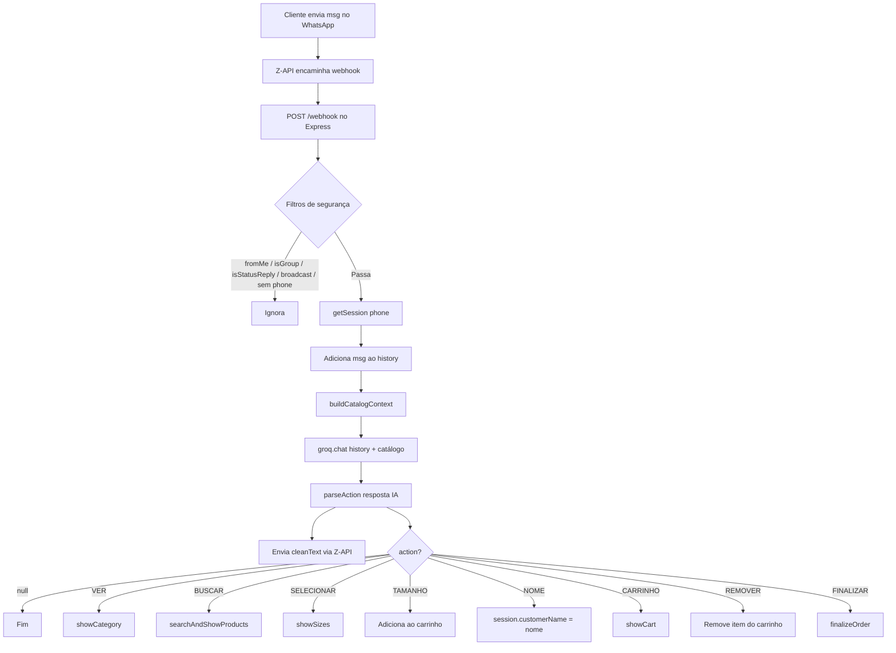
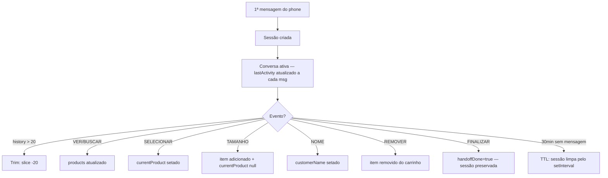
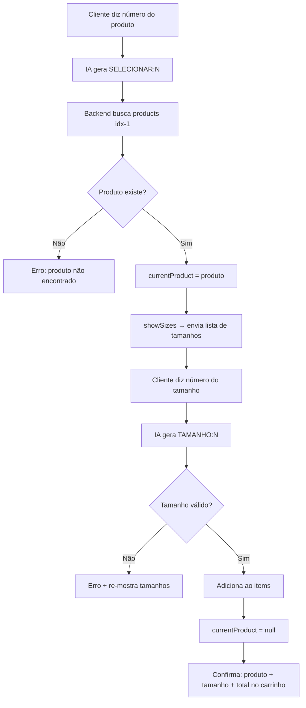
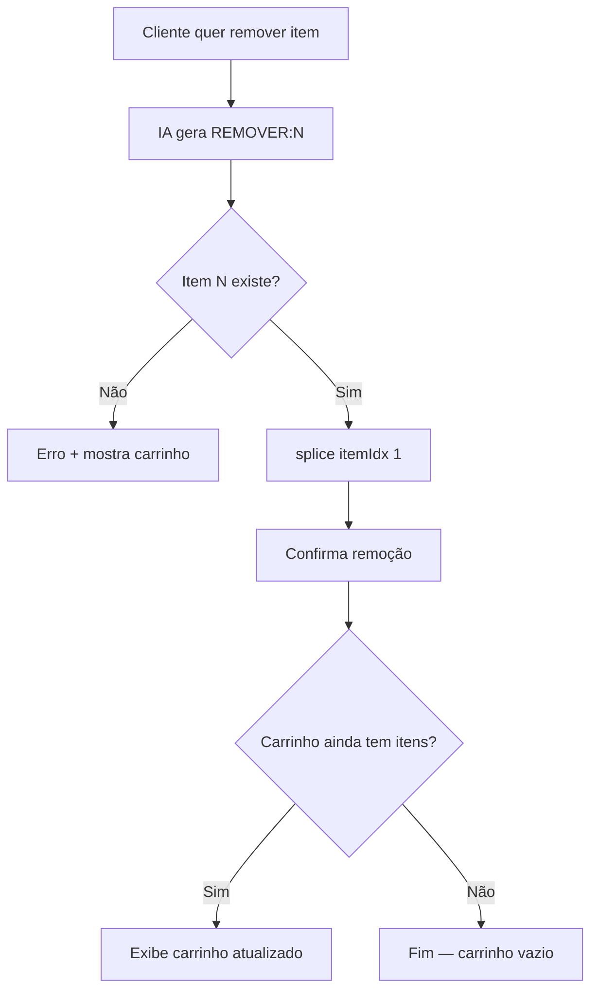

# Arquitetura — Referência Completa

> Visão geral do fluxo, sessões, carrinho e execução de ações

---

## Sumário

1. [Fluxo Geral](#fluxo-geral)
2. [Sessões](#sessões)
3. [Carrinho de Compras](#carrinho-de-compras)
4. [Executor de Ações](#executor-de-ações)
5. [Fluxos de Venda](#fluxos-de-venda)
6. [Finalização de Pedido](#finalização-de-pedido)
7. [Health Check](#health-check)
8. [Decisões Técnicas (ADRs)](#decisões-técnicas)

---

## Fluxo Geral



### Sequência Detalhada

1. Cliente envia mensagem no WhatsApp
2. Z-API faz POST no `/webhook` do servidor
3. Express recebe, responde `200` imediatamente
4. Filtros de segurança: phone não vazio, não é `fromMe`, não é grupo, não é status/broadcast
5. Busca/cria sessão para o phone, atualiza `lastActivity`
6. Adiciona mensagem ao histórico da sessão
7. Monta contexto (produtos carregados + itens do carrinho)
8. Chama Groq com histórico + catálogo
9. Remove blocos `<think>` da resposta
10. Faz parsing de action tokens
11. Envia texto limpo ao cliente via Z-API
12. Se houver action → executa ação correspondente

---

## Sessões

### Estrutura

```javascript
const sessions = {}; // Em memória + persistência Supabase

sessions['5585999999999'] = {
  history: [],          // Histórico de conversa [{role, content}] — máx 20
  items: [],            // Carrinho [{productId, productName, size, quantity, unitPrice, price}]
  products: [],         // Produtos da última busca/categoria visualizada
  currentProduct: null, // Produto selecionado (contexto de reply)
  customerName: null,   // Nome do cliente (registrado via [NOME:nome])
  currentCategory: null,      // Slug da categoria ativa
  currentPage: 0,             // Página atual (paginação)
  totalPages: 1,              // Total de páginas
  lastViewedProduct: null,    // Último produto visualizado
  lastActivity: Date.now(),   // Timestamp da última mensagem (para TTL)
  purchaseFlow: {             // FSM de compra interativa
    state: 'idle',            // idle | awaiting_size | awaiting_quantity | awaiting_more_sizes
    productId: null,          // ID do produto em processo
    productName: null,        // Nome do produto em processo
    price: null,              // Preço unitário
    selectedSize: null,       // Tamanho selecionado
    addedSizes: [],           // Tamanhos já adicionados (fluxo atacado)
    interactiveVersion: null, // Timestamp de versão dos menus (anti-stale)
    buyQueue: [],             // Fila de produtos pendentes (cliques simultâneos)
  },
};
```

### TTL Automático

```javascript
const SESSION_TIMEOUT_MS = 30 * 60 * 1000; // 30 minutos

setInterval(() => {
  const now = Date.now();
  for (const phone of Object.keys(sessions)) {
    if (now - sessions[phone].lastActivity > SESSION_TIMEOUT_MS) {
      delete sessions[phone]; // limpa sessão inativa
    }
  }
}, 10 * 60 * 1000); // verifica a cada 10 minutos
```

### Ciclo de Vida



### Regras

| Regra | Implementação |
|---|---|
| Criação | Automática na 1ª mensagem (`getSession`) |
| Histórico máximo | 20 mensagens (trim com `slice(-20)`) |
| Destruição manual | Após `FINALIZAR` (`delete sessions[phone]`) |
| Destruição automática | TTL 30min inatividade |
| Persistência | ❌ Não persiste — reinicia com o servidor |

---

## Carrinho de Compras

### Estrutura de Item

```javascript
{
  productId: 123,                  // ID do WooCommerce
  productName: "Calcinha Renda",   // Nome do produto
  size: "M",                       // Tamanho selecionado
  price: "39.90",                  // Preço numérico string (salePrice || price)
}
```

### Fluxo de Adição



### Fluxo de Remoção



### Visualização do Carrinho

```
🛒 *SEU CARRINHO*
─────────────────
1. *Calcinha Renda Floral*
   📏 Tam: M | 💰 R$ 39,90
2. *Sutiã Push-Up Básico*
   📏 Tam: G | 💰 R$ 59,90
─────────────────
💰 *Total: R$ 99,80*

➕ Continue escolhendo
🗑️ Para remover: diga "remover item N"
✅ Para fechar: diga "finalizar"
```

---

## Executor de Ações

```javascript
async function executeAction(phone, action, session) {
  switch (action.type) {
    case 'VER':       await showCategory(phone, action.payload, session); break;
    case 'BUSCAR':    await searchAndShowProducts(phone, action.payload, session); break;
    case 'SELECIONAR': /* busca produto por índice, seta currentProduct */ break;
    case 'TAMANHO':   /* valida tamanho, adiciona ao carrinho */ break;
    case 'NOME':      session.customerName = action.payload.trim(); break;
    case 'CARRINHO':  await showCart(phone, session); break;
    case 'REMOVER':   /* remove item por índice */ break;
    case 'FINALIZAR': await finalizeOrder(phone, session); break;
  }
}
```

### Ações Detalhadas

| Ação | Input | Efeito | Output |
|---|---|---|---|
| `VER` | slug da categoria | Busca WC por categoria, salva em `session.products` | Lista + imagens |
| `BUSCAR` | termo de busca | Busca WC por texto, salva em `session.products` | Lista + imagens |
| `SELECIONAR` | índice (1-based) | Seta `session.currentProduct` | Lista de tamanhos |
| `TAMANHO` | índice (1-based) | Adiciona item ao carrinho, limpa currentProduct | Confirmação |
| `NOME` | string | Registra `session.customerName` | Nenhum output |
| `CARRINHO` | — | Lê `session.items` | Resumo do carrinho |
| `REMOVER` | índice (1-based) | Remove item de `session.items` | Confirmação + carrinho |
| `FINALIZAR` | — | Gera pedido, notifica admin, seta `handoffDone=true` (sessão preservada) | Confirmação |

---

## Fluxos de Venda

### Fluxo Completo (Happy Path)

```
Cliente: "Oi, sou a Ana, quero ver lingeries"
Bela: "Olá, Ana! 💜 Que bom ter você aqui! Vou te mostrar nossas opções femininas!" [VER:feminino] [NOME:Ana]
Bot: 🔍 Buscando produtos feminino...
Bot: 📦 Feminino — 3 produto(s):
     1. Calcinha Renda — R$ 39,90
     2. Sutiã Push-Up — R$ 59,90
     3. Conjunto Noite — R$ 89,90
Bot: [imagem 1] [imagem 2] [imagem 3]

Cliente: "Quero o 1"
Bela: "A calcinha renda é linda! Qual tamanho?" [SELECIONAR:1]
Bot: 📏 Calcinha Renda Floral — 1. P  2. M  3. G  4. GG

Cliente: "M"
Bela: "M perfeito! ✨" [TAMANHO:2]
Bot: ✅ Calcinha Renda Floral (Tam: M) adicionado! 🛒 1 item.

Cliente: "Finalizar"
Bela: "Perfeito, Ana! Vou fechar seu pedido!" [FINALIZAR]
Bot: ✅ Pedido recebido! (resumo completo com nome da cliente)
```

### Fluxo com Busca Livre

```
Cliente: "Tem algum conjunto sexy em promoção?"
Bela: "Boa pergunta! Vou buscar pra você!" [BUSCAR:conjunto promoção]
Bot: 🔍 Buscando "conjunto promoção"...
Bot: 🔎 Resultados para "conjunto promoção" — 2 produto(s): ...
```

### Fluxo de Remoção do Carrinho

```
Cliente: "Quero remover o item 1"
Bela: "Claro! Removendo agora." [REMOVER:1]
Bot: 🗑️ Calcinha Renda Floral (Tam: M) removido. 🛒 1 item restante.
Bot: [carrinho atualizado]
```

---

## Finalização de Pedido

```javascript
async function finalizeOrder(phone, session) {
  // 1. Valida carrinho não vazio
  // 2. Monta resumo com customerName (ou "Cliente")
  // 3. Envia confirmação ao cliente
  // 4. Se ADMIN_PHONE configurado → notifica admin via Z-API
  // 5. Loga no console
  // 6. Deleta sessão
  delete sessions[phone];
}
```

**Notificação ao admin:** configurada via variável `ADMIN_PHONE` no `.env`. Se definida, o bot envia automaticamente o resumo do pedido para esse número no WhatsApp.

---

## Health Check

```javascript
app.get('/', (_req, res) => {
  res.json({
    status: 'online',
    service: 'Vendedor Digital - Belux Moda Íntima',
    activeSessions: Object.keys(sessions).length,
  });
});
```

**Teste:** `curl http://localhost:3000/`

---

## Decisões Técnicas

### ADR-001: Evolution API → Z-API (2026-03-25)

**Contexto:** Evolution API self-hosted (Docker) tinha problemas crônicos de QR Code no Windows/WSL2.

**Decisão:** Migrar para Z-API (SaaS gerenciado).

**Consequências:**
- ✅ Sem necessidade de Docker/infraestrutura local
- ✅ QR Code gerenciado pelo painel Z-API
- ✅ Mais estável e confiável
- ❌ Custo mensal do serviço

### ADR-002: Action Tokens no Prompt (2026-03-25)

**Contexto:** Como fazer a IA disparar ações no backend?

**Decisão:** Tokens de ação no texto da resposta (`[VER:feminino]`, `[SELECIONAR:1]`, etc.) parseados com regex.

**Consequências:**
- ✅ Simples, funciona com qualquer modelo
- ✅ Fácil de debugar
- ❌ Apenas 1 ação por resposta
- ❌ Não usa function calling nativo

### ADR-003: Sessões em Memória (2026-03-25)

**Contexto:** Onde armazenar estado do cliente?

**Decisão:** Objeto JavaScript em memória + TTL automático de 30min.

**Consequências:**
- ✅ Zero latência, zero dependência externa
- ✅ TTL evita memory leak
- ❌ Perde tudo no restart do servidor
- ❌ Não escala para múltiplas instâncias

### ADR-022: Reply como Cursor de Seleção B2B + Tamanho Único (2026-04-11)

**Contexto:** Lojistas B2B dão reply em cards antigos digitando grades ("3P 5M 2G") enquanto a FSM está ocupada com outro produto. O bot ignorava o reply e adicionava ao produto errado.

**Decisão:** Quote resolve o alvo ANTES da FSM. Novo helper `switchFsmFocus(session, newProduct)` troca o foco e preserva o produto antigo via `pf.buyQueue.unshift(snapshot)` (topo, não fim). Produto de tamanho único pula `awaiting_size` e vai direto para `awaiting_quantity`. `normalizeSizeLabel` colapsa variantes ("Tam único - pct com 5 unidades") para `'ÚNICO'`. Ver [[quote-reply-logic]] para detalhe completo.

**⚠️ Isto é feature, não bug.** Não remova esta lógica.

### ADR-005: FSM de Compra Interativa com buyQueue (2026-04-03)

**Contexto:** Clientes clicam em "Comprar" em vários produtos quase simultaneamente antes de terminar o fluxo do primeiro. O campo `currentProduct` suportava apenas 1 produto ativo, fazendo o segundo clic sobrescrever o fluxo em andamento.

**Decisão:** Implementar uma FSM (`purchaseFlow`) com estados (`idle → awaiting_size → awaiting_quantity → awaiting_more_sizes → idle`) e uma fila `buyQueue` que acumula produtos enquanto a FSM está ocupada.

**Fluxo da Fila:**
1. Cliente clica "Comprar" em produto A → FSM entra em `awaiting_size`
2. Cliente clica "Comprar" em produto B → produto B vai para `buyQueue`; Bela confirma: *"✅ Produto B anotado na fila! Vamos um de cada vez 😊"*
3. Após finalizar produto A (tamanhos/quantidade): `processNextInQueue` busca produto B da fila e inicia automaticamente
4. Menu pós-adição: quando há itens na `buyQueue`, o botão "Próximo Produto" (`skip_more_v{version}`) aparece no lugar de "Ver Mais Produtos"

**Funções-chave:**
- `handlePurchaseFlowEvent(phone, eventId, session)` — roteador central da FSM
- `addToCart(phone, quantity, session)` — adiciona item, chama `processNextInQueue` se fila não vazia
- `processNextInQueue(phone, session)` — avança para o próximo produto da fila
- `resetPurchaseFlow(session)` — reseta FSM preservando `buyQueue`
- `sendPostAddMenu(phone, session, remainingSizes)` — menu pós-adição; exibe botão de fila quando aplicável

**Consequências:**
- ✅ Múltiplos produtos processados sequencialmente sem perda
- ✅ Bela comunica claramente a fila para o cliente
- ✅ Transição automática entre produtos da fila
- ❌ Produtos da fila precisam estar em `session.products` (mesma categoria/busca)

### ADR-004: Reorganização do Agente (2026-03-26)

**Contexto:** Melhorar capacidade conversacional e robustez.

**Decisão:** Expandir tokens de ação (`BUSCAR`, `NOME`, `REMOVER`), adicionar cache de categorias WooCommerce, TTL de sessões, notificação de admin, e filtros de segurança completos.

**Consequências:**
- ✅ Bela registra o nome do cliente
- ✅ Busca livre de produtos por descrição
- ✅ Cliente pode remover itens do carrinho
- ✅ TTL automático resolve memory leak
- ✅ Cache de IDs de categoria melhora performance
- ✅ Admin notificado de cada pedido finalizado
