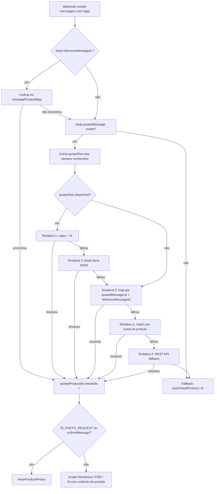

# 🔧 Fix: Resolução de Produto em Mensagem Citada (Track 2 — Revisão Completa)

**Status:** 🔴 Bug Ativo — Implementação Anterior com Premissa Errada
**Arquivo afetado:** `index.js`, `services/zapi.js`
**Conexões:** [[arquitetura]], [[zapi]], [[bugs]], [[implementacao-tracks]]
**Atualizado:** 2026-04-04

> **Leia este documento inteiro antes de escrever uma linha de código.**
> Este documento substitui e corrige a seção "Track 2" de `implementacao-tracks.md`.
> A implementação anterior foi aplicada mas NÃO funciona. Este doc explica o porquê e diz o que fazer.

---

## 1. O Problema (Print de Diagnóstico)

Cliente cita a vitrine de um produto (mensagem de botão enviada pela Bela) e digita:
> "Quero 3 P dessa"

A Bela responde:
> "Ah, que maravilha! Mas me diz, qual dessas peças você gostou?"

O produto citado NÃO foi identificado. A mensagem foi para a IA sem contexto de produto, e a IA pediu a informação que já estava no reply.

---

## 2. Por que a Implementação Anterior Falhou

### 2.1 A premissa errada do Track 2 original

O documento `implementacao-tracks.md` assumiu:

> "Quando a Bela envia uma vitrine, a Z-API devolve um `zaapId`. Quando o cliente faz reply, o `body.quotedMessage` traz o `messageId` da mensagem citada — que é o mesmo `zaapId`."

**Isso está errado.** A Z-API retorna dois IDs DISTINTOS ao enviar uma mensagem:

```json
{
  "zaapId": "3999984263738042930CD6ECDE9VDWSA",
  "messageId": "D241XXXX732339502B68",
  "id": "D241XXXX732339502B68"
}
```

| Campo | O que é | Onde aparece |
|---|---|---|
| `zaapId` | ID interno da Z-API (tracking deles) | Só na resposta do POST |
| `messageId` | ID real da mensagem no WhatsApp | Resposta do POST **e** webhook de reply |
| `id` | Mesmo valor de `messageId` (alias Zapier) | Resposta do POST |

O código atual armazena pelo `zaapId`, mas o webhook de reply referencia o `messageId`. Nunca vão coincidir.

### 2.2 O campo de lookup está no lugar errado

A documentação oficial da Z-API confirma:

> "referenceMessageId: Referência a mensagem que foi respondida"

Este campo fica na **raiz do `body`**, não dentro de `body.quotedMessage`:

```json
{
  "messageId": "ID_DA_NOVA_MENSAGEM_DO_CLIENTE",
  "referenceMessageId": "D241XXXX732339502B68",   ← RAIZ do body
  "text": { "message": "Quero 3 P dessa" },
  "quotedMessage": { ... }   ← pode estar vazio ou ausente para button messages
}
```

O código atual busca o ID em:
```javascript
body.quotedMessage.messageId || body.quotedMessage.stanzaId || body.quotedMessage.id
```

Nenhum desses campos existe para mensagens de botão citadas. O `referenceMessageId` está na raiz e é completamente ignorado.

### 2.3 `quotedText` é null para button-list messages

`sendProductShowcase` envia uma mensagem do tipo `/send-button-list`. Quando citada, a Z-API frequentemente só envia `referenceMessageId` na raiz, sem `quotedMessage` com texto. Por isso:

- `body?.quotedMessage` pode ser falsy → o bloco inteiro é pulado
- Mesmo que exista, nenhum dos paths de extração cobre button messages
- `quotedText` fica `null` → Tentativa 4 (nome) também é pulada porque verifica `&& quotedText`

---

## 3. Pesquisa Adicional — Plano ZWSP (Zero-Width Space)

O pesquisador do projeto propôs uma abordagem complementar: embedar o ID do produto em caracteres invisíveis Unicode (Zero-Width Space `U+200B`, Zero-Width Non-Joiner `U+200C`, Zero-Width Joiner `U+200D`) no texto da mensagem da vitrine.

**Avaliação:**

| Aspecto | Análise |
|---|---|
| Funciona em texto livre | ✅ Confirmado — ZWSP sobrevive a copy/paste no WhatsApp |
| Funciona em button-list quoted | ⚠️ Incerto — se `quotedText` for null para button messages, o ZWSP nunca é lido |
| Consistência entre plataformas | ⚠️ Android, iOS e WhatsApp Web podem sanitizar de forma diferente |
| Complexidade de implementação | Média — requer módulo `utils/hiddenId.js` de encode/decode |
| Robustez como camada primária | ❌ Insuficiente — depende de `quotedText` que é o campo problemático |
| Robustez como camada de redundância | ✅ Boa ideia para imagens avulsas onde `quotedText` está disponível |

**Conclusão sobre ZWSP:** implementar como **Camada 3 de fallback** (após `referenceMessageId`), não como camada primária. Resolve o caso de imagens simples com caption mas não resolve button messages.

---

## 4. Solução Combinada — 3 Correções + 1 Opcional

### Correção 1 — Armazenar `messageId` (não `zaapId`) no map

**Arquivo:** `index.js`
**Função:** `registerMessageProduct` (~linha 1102)

**Antes (errado):**
```javascript
function registerMessageProduct(session, zaapId, product) {
  if (!zaapId || !product || !session.messageProductMap) return;
  const idx = session.products?.indexOf(product);
  session.messageProductMap[zaapId] = { productId: product.id, productIdx: (idx >= 0 ? idx + 1 : null) };
  const keys = Object.keys(session.messageProductMap);
  if (keys.length > 50) keys.slice(0, 25).forEach(k => delete session.messageProductMap[k]);
}
```

**Depois (correto):**
```javascript
function registerMessageProduct(session, zaapId, messageId, product) {
  if (!product || !session.messageProductMap) return;
  const idx = session.products?.indexOf(product);
  const entry = { productId: product.id, productIdx: (idx >= 0 ? idx + 1 : null) };
  // Armazena pelo messageId (ID real do WhatsApp — usado no referenceMessageId do webhook)
  if (messageId) session.messageProductMap[messageId] = entry;
  // Também pelo zaapId como fallback de compatibilidade
  if (zaapId) session.messageProductMap[zaapId] = entry;
  const keys = Object.keys(session.messageProductMap);
  if (keys.length > 50) keys.slice(0, 25).forEach(k => delete session.messageProductMap[k]);
}
```

### Correção 2 — Passar `messageId` em todas as chamadas de `registerMessageProduct`

**Arquivo:** `index.js`
**Buscar:** todas as chamadas `registerMessageProduct(session, res?.data?.zaapId, product)`
**Atualizar para:** incluir `res?.data?.messageId` como segundo argumento

Padrão de substituição:
```javascript
// ANTES:
registerMessageProduct(session, scRes?.data?.zaapId, product);
registerMessageProduct(session, imgRes?.data?.zaapId, product);

// DEPOIS:
registerMessageProduct(session, scRes?.data?.zaapId, scRes?.data?.messageId, product);
registerMessageProduct(session, imgRes?.data?.zaapId, imgRes?.data?.messageId, product);
```

Há aproximadamente 6 ocorrências no arquivo. Substituir todas.

### Correção 3 — Usar `body.referenceMessageId` no lookup (raiz do body)

**Arquivo:** `index.js`
**Localização:** bloco de resolução de produto citado (~linha 584)

O lookup do `messageProductMap` deve acontecer **fora** do bloco `if (body?.quotedMessage)` porque `referenceMessageId` existe na raiz mesmo quando `quotedMessage` está ausente.

Adicionar logo após a declaração de `quotedProductIdx` (~linha 584), antes do `if (body?.quotedMessage)`:

```javascript
let quotedProductIdx = null;
let finalUserText = text;

// ── Tentativa 0: referenceMessageId na raiz do body (Z-API button-list replies) ──
// Z-API envia o ID da mensagem citada em body.referenceMessageId para mensagens interativas.
// Este campo referencia o messageId retornado no POST de envio (não o zaapId).
if (!quotedProductIdx && body?.referenceMessageId && session.messageProductMap) {
  const mapped = session.messageProductMap[body.referenceMessageId];
  if (mapped) {
    const productStillLoaded = session.products?.some(p => p.id === mapped.productId);
    if (productStillLoaded) {
      quotedProductIdx = mapped.productIdx;
      // Reconstruir contexto da citação para a IA (quotedText virá null para button messages)
      const prod = session.products.find(p => p.id === mapped.productId);
      if (prod) {
        const price = prod.salePrice
          ? `R$ ${parseFloat(prod.salePrice).toFixed(2).replace('.', ',')}`
          : `R$ ${parseFloat(prod.price).toFixed(2).replace('.', ',')}`;
        finalUserText = `[O cliente citou a vitrine do produto "${prod.name}" (${price})]\n\nMensagem do cliente: "${text}"`;
      }
      logger.info(
        { refMsgId: body.referenceMessageId, productId: mapped.productId, productIdx: mapped.productIdx },
        '[QuotedProduct] Resolvido via referenceMessageId (raiz) ✓'
      );
    }
  }
}
```

Além disso, dentro do bloco `if (body?.quotedMessage)` existente, atualizar a Tentativa 3 para também checar `referenceMessageId` como fallback adicional:

```javascript
// Tentativa 3 (messageProductMap): lookup pelo messageId do quotedMessage ou referenceMessageId
if (!extractedIdx && session.products?.length > 0 && session.messageProductMap) {
  const mapMsgId = body.referenceMessageId          // ← NOVO: raiz do body
    || body.quotedMessage.messageId
    || body.quotedMessage.stanzaId
    || body.quotedMessage.id;
  if (mapMsgId && session.messageProductMap[mapMsgId]) {
    // ... resto do lookup igual ao atual ...
  }
}
```

---

## 5. Opcional — ZWSP como Camada de Redundância

> **Implemente apenas após as 3 correções acima estarem funcionando.**
> Esta camada protege casos de imagens simples (não button) onde `quotedText` está disponível.

### 5.1 Criar `utils/hiddenId.js`

```javascript
// utils/hiddenId.js
// Codifica IDs numéricos em caracteres Unicode invisíveis para embedar em mensagens WhatsApp.
// Sobrevive a citações (reply) no WhatsApp preservando o ID do produto.

const DELIM = '\u200D';   // Zero Width Joiner — delimitador
const BIT_0 = '\u200B';   // Zero Width Space — representa bit 0
const BIT_1 = '\u200C';   // Zero Width Non-Joiner — representa bit 1

function encode(idStr) {
  const bits = parseInt(idStr, 10).toString(2)
    .split('').map(b => b === '0' ? BIT_0 : BIT_1).join('');
  return DELIM + bits + DELIM;
}

function extractAndDecode(text) {
  if (!text) return null;
  const m = text.match(new RegExp(`${DELIM}([${BIT_0}${BIT_1}]+)${DELIM}`));
  if (!m) return null;
  try {
    const num = parseInt(m[1].split('').map(c => c === BIT_0 ? '0' : '1').join(''), 2);
    return isNaN(num) ? null : String(num);
  } catch { return null; }
}

module.exports = { encode, extractAndDecode };
```

### 5.2 Modificar `sendProductShowcase` em `services/zapi.js`

```javascript
const hiddenId = require('../utils/hiddenId');

async function sendProductShowcase(phone, product, version) {
  // ...price calc...
  const payload = {
    phone,
    message: `✨ *${product.name}*\n💰 ${price}${hiddenId.encode(String(product.id))}`,
    // ... resto igual
  };
}
```

### 5.3 Adicionar extração ZWSP no chain de `quotedText`

No bloco `if (body?.quotedMessage)`, após extrair `quotedText`, adicionar:

```javascript
// Tentativa ZWSP: extrair ID oculto do quotedText (fallback para imagens com caption)
if (!extractedIdx && quotedText) {
  const hiddenId = require('./utils/hiddenId');
  const decodedId = hiddenId.extractAndDecode(quotedText);
  if (decodedId) {
    const product = session.products?.find(p => String(p.id) === decodedId);
    if (product) {
      extractedIdx = session.products.indexOf(product) + 1;
      logger.info({ productId: decodedId, productIdx: extractedIdx }, '[QuotedProduct] Resolvido via ZWSP ✓');
    }
  }
}
```

---

## 6. Ordem de Implementação

```
1. Correção 1: atualizar registerMessageProduct (assinar + armazenar messageId)
2. Correção 2: atualizar ~6 chamadas de registerMessageProduct (passar messageId)
3. Correção 3: adicionar Tentativa 0 com referenceMessageId antes do if (body?.quotedMessage)
4. Correção 3b: atualizar Tentativa 3 interna para checar referenceMessageId também
5. node --check index.js → deve passar sem erros
6. [Opcional] ZWSP: criar utils/hiddenId.js → modificar sendProductShowcase → adicionar extração
```

---

## 7. Como Testar

| Cenário | Esperado após o fix |
|---|---|
| Cliente cita vitrine (button) e digita "Quero 3 P dessa" | `[QuotedProduct] Resolvido via referenceMessageId ✓` nos logs; `quotedProductIdx` definido; FSM ou grade semântica ativados |
| Cliente cita vitrine e digita "tem foto?" | `quotedProductIdx` definido; `showProductPhotos` chamado para produto correto |
| Cliente cita imagem avulsa (com ZWSP implementado) | `[QuotedProduct] Resolvido via ZWSP ✓` nos logs |
| Sessão antiga sem `messageId` no map | `referenceMessageId` lookup falha → cai para tentativas existentes → sem regressão |

---

## 8. Diagrama do Fluxo Corrigido


