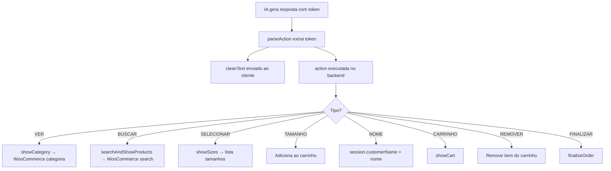

# Groq SDK — Referência Completa

> IA conversacional do Agente Belux · Modelo: qwen/qwen3-32b via Groq

---

## Sumário

1. [Configuração](#configuração)
2. [System Prompt (Persona "Bela")](#system-prompt)
3. [Action Tokens](#action-tokens)
4. [Fluxo de Chat](#fluxo-de-chat)
5. [Parsing de Ações](#parsing-de-ações)
6. [Parâmetros do Modelo](#parâmetros-do-modelo)
7. [Catálogo no Contexto](#catálogo-no-contexto)
8. [Otimização de Tokens](#otimização-de-tokens)
9. [Modelos Disponíveis na Groq](#modelos-disponíveis-na-groq)

---

## Configuração

```env
GROQ_API_KEY=gsk_xxxxx
```

```javascript
const Groq = require('groq-sdk');
const client = new Groq({ apiKey: process.env.GROQ_API_KEY });
```

---

## System Prompt

A persona da IA se chama **Bela** — consultora de moda íntima da Belux.

Destaques do prompt atual:

```
SOBRE A BELUX:
- Especializada em moda íntima feminina, masculina e infantil
- Foco em qualidade, conforto e elegância

PERSONALIDADE:
- Seja calorosa, simpática e consultiva
- Faça perguntas para entender o que o cliente precisa
- Quando o cliente mencionar o próprio nome, registre-o com [NOME:nome]
- Elogie escolhas e crie desejo pelos produtos
- Use emojis com moderação
- Seja concisa — máximo 3 frases por resposta

CATEGORIAS: Feminino, Masculino, Infantil
```

### Regras da Persona

| Regra | Detalhe |
|---|---|
| Idioma | Sempre PT-BR |
| Tom | Calorosa, consultiva, como vendedora experiente |
| Concisão | Máximo 3 frases por resposta |
| Emojis | Com moderação |
| Produtos | NUNCA inventar — apenas os do catálogo |
| Action tokens | Apenas 1 por resposta, sempre no final |

---

## Action Tokens

O sistema de "action tokens" permite que a IA dispare ações no backend através de marcadores no texto da resposta.

### Tokens Disponíveis

| Token | Regex | Quando a IA usa |
|---|---|---|
| `[VER:feminino\|masculino\|infantil]` | `/\[VER:(feminino\|masculino\|infantil)\]/i` | Cliente quer ver categoria |
| `[BUSCAR:termo]` | `/\[BUSCAR:([^\]]+)\]/i` | Cliente descreve produto específico |
| `[SELECIONAR:N]` | `/\[SELECIONAR:(\d+)\]/i` | Cliente escolheu produto pelo número |
| `[TAMANHO:N]` | `/\[TAMANHO:(\d+)\]/i` | Cliente escolheu tamanho pelo número |
| `[NOME:nome]` | `/\[NOME:([^\]]+)\]/i` | Cliente mencionou o próprio nome |
| `[CARRINHO]` | `/\[CARRINHO\]/i` | Cliente quer ver o carrinho |
| `[REMOVER:N]` | `/\[REMOVER:(\d+)\]/i` | Cliente quer remover item N do carrinho |
| `[FINALIZAR]` | `/\[FINALIZAR\]/i` | Cliente quer fechar o pedido |

### Fluxo de Ação



### Exemplo Real

**Cliente:** "Quero ver lingeries femininas"

**IA responde:**
```
Ótima escolha! 💜 Temos opções lindas no feminino. Deixa eu te mostrar! [VER:feminino]
```

**Backend:**
1. `parseAction` extrai `{ type: 'VER', payload: 'feminino' }`
2. `cleanText` = "Ótima escolha! 💜 Temos opções lindas no feminino. Deixa eu te mostrar!"
3. `cleanText` é enviado ao WhatsApp
4. `executeAction` chama `showCategory(phone, 'feminino', session)`

---

## Fluxo de Chat

```javascript
async function chat(history, catalogContext) {
  const systemContent = catalogContext
    ? `${SYSTEM_PROMPT}\n\nCATÁLOGO / CONTEXTO DA SESSÃO:\n${catalogContext}`
    : SYSTEM_PROMPT;

  const messages = [
    { role: 'system', content: systemContent },
    ...history,
  ];

  const completion = await client.chat.completions.create({
    model: 'qwen/qwen3-32b',
    messages,
    temperature: 0.7,
    max_completion_tokens: 500,
    stream: false,
  });

  const raw = completion.choices[0].message.content || '';
  // Strip <think>...</think> blocks (reasoning model artifact)
  return raw.replace(/<think>[\s\S]*?<\/think>/gi, '').trim();
}
```

**⚠️ O modelo qwen3-32b é um "reasoning model" que pode gerar blocos `<think>`.
Estes são removidos com regex antes de processar.**

---

## Parsing de Ações

```javascript
function parseAction(text) {
  const tokens = {
    VER:        /\[VER:(feminino|masculino|infantil)\]/i,
    BUSCAR:     /\[BUSCAR:([^\]]+)\]/i,
    SELECIONAR: /\[SELECIONAR:(\d+)\]/i,
    TAMANHO:    /\[TAMANHO:(\d+)\]/i,
    NOME:       /\[NOME:([^\]]+)\]/i,
    CARRINHO:   /\[CARRINHO\]/i,
    REMOVER:    /\[REMOVER:(\d+)\]/i,
    FINALIZAR:  /\[FINALIZAR\]/i,
  };

  for (const [type, regex] of Object.entries(tokens)) {
    const match = text.match(regex);
    if (match) {
      const cleanText = text.replace(regex, '').trim();
      return { cleanText, action: { type, payload: match[1] || null } };
    }
  }

  return { cleanText: text, action: null };
}
```

**Retorna:**
```javascript
// Com ação
{ cleanText: "Ótima escolha!", action: { type: 'VER', payload: 'feminino' } }

// Sem ação
{ cleanText: "Olá! Como posso te ajudar?", action: null }
```

---

## Parâmetros do Modelo

| Parâmetro | Valor | Justificativa |
|---|---|---|
| `model` | `qwen/qwen3-32b` | Bom custo-benefício, suporta PT-BR |
| `temperature` | `0.7` | Criativo mas controlado |
| `max_completion_tokens` | `500` | Respostas completas + token de ação |
| `stream` | `false` | Necessário para parsing de action tokens |

### Considerações

- **Temperature 0.7:** Bom para tom conversacional. Se a IA inventar produtos, baixar para 0.3-0.5.
- **500 tokens:** Suficiente para 3 frases + 1 action token. Suficiente para respostas de listagem.
- **Stream false:** Necessário para parsing correto (precisa do texto completo).

---

## Catálogo no Contexto

Quando há produtos carregados na sessão, o catálogo + estado do carrinho são injetados no system prompt:

```javascript
function buildCatalogContext(session) {
  if (!session.products || session.products.length === 0) return null;

  let ctx = `Produtos disponíveis (${session.products.length}):\n`;
  session.products.forEach((p, i) => {
    const price = p.salePrice || p.price;
    ctx += `${i + 1}. ${p.name} — R$ ${price}`;
    if (p.sizes.length > 0) ctx += ` — Tamanhos: ${p.sizes.join(', ')}`;
    ctx += '\n';
  });

  if (session.items.length > 0) {
    ctx += `\nCarrinho atual (${session.items.length} itens):\n`;
    session.items.forEach((item, i) => {
      ctx += `${i + 1}. ${item.productName} (Tam: ${item.size}) — R$ ${item.price}\n`;
    });
  }

  return ctx;
}
```

**Exemplo de contexto injetado:**
```
CATÁLOGO / CONTEXTO DA SESSÃO:
Produtos disponíveis (3):
1. Calcinha Renda Floral — R$ 39.90 — Tamanhos: P, M, G, GG
2. Sutiã Push-Up Básico — R$ 59.90 — Tamanhos: P, M, G
3. Conjunto Noite Especial — R$ 89.90 — Tamanhos: M, G

Carrinho atual (1 item):
1. Calcinha Renda Floral (Tam: M) — R$ 39.90
```

---

## Otimização de Tokens

### Práticas Atuais
- Histórico limitado a **20 mensagens** (slice)
- Catálogo apenas quando há produtos carregados
- Carrinho incluído no contexto quando há itens
- `max_completion_tokens: 500`

### Melhorias Planejadas
- **Resumo de contexto:** Quando histórico > 15, resumir as primeiras mensagens
- **RAG:** Indexar produtos para busca por similaridade

---

## Modelos Disponíveis na Groq

| Modelo | Contexto | Velocidade | Uso sugerido |
|---|---|---|---|
| `qwen/qwen3-32b` | 32k | Rápido | **Atual** — bom para PT-BR |
| `llama-3.3-70b-versatile` | 128k | Médio | Alternativa com mais contexto |
| `llama-3.1-8b-instant` | 128k | Muito rápido | Para respostas simples/rápidas |
| `gemma2-9b-it` | 8k | Rápido | Alternativa leve |

**Para trocar o modelo**, altere apenas a string em `groq.js`:
```javascript
model: 'qwen/qwen3-32b', // ← alterar aqui
```
