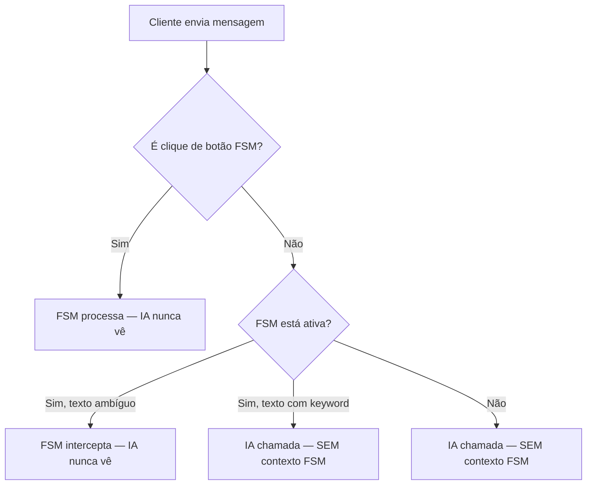
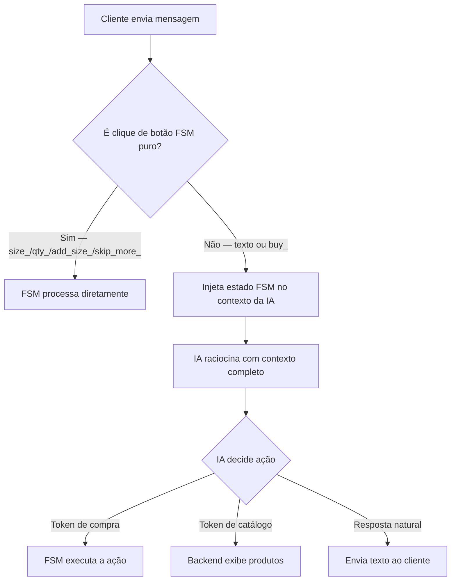

# 🧠 A Inteligência da Bela — Princípios e Arquitetura

> **Este documento é leitura obrigatória antes de qualquer mudança no `index.js`.**
> Ele define COMO a Bela deve pensar, não apenas o que ela deve fazer.

---

## O Problema Central

A Bela está se tornando **robótica e burra** porque a FSM (máquina de estados de compra) e a IA (Gemini) operam como dois sistemas **completamente isolados**. A IA não sabe o que a FSM está fazendo. A FSM não sabe o que a IA pensou. O resultado: quando o cliente faz qualquer coisa fora do script de cliques de botão, o sistema quebra ou ignora.

**Exemplo real do problema:**
```
Cliente clica "Comprar" em Chocolate → FSM envia lista de tamanhos
Cliente digita "quero 3 do G" (como uma pessoa normal faria)
→ A IA não sabe que está no meio de uma compra do Chocolate
→ A IA não sabe que "G" é um tamanho da lista ativa
→ A IA inventa uma resposta aleatória ou pede categoria
→ Nada é adicionado ao carrinho
```

---

## A Regra de Ouro

> **A IA é o cérebro. A FSM são as mãos.**

A IA deve sempre raciocinar sobre o contexto completo da conversa — incluindo o estado atual da FSM — e decidir o que fazer. A FSM só executa decisões mecânicas (enviar lista de tamanhos, registrar quantidade, adicionar ao carrinho). Ela nunca deve bloquear o raciocínio da IA.

---

## O Problema Arquitetural: IA Cega para a FSM

### Como está hoje (ERRADO)



**O gap:** Em nenhum dos caminhos acima a IA recebe o estado atual da FSM. Ela não sabe:
- Que produto está sendo comprado agora
- Quais tamanhos estão disponíveis para esse produto
- Quantas peças estão na fila (`buyQueue`)
- Que o cliente está em `awaiting_size`, `awaiting_quantity` ou `awaiting_more_sizes`
- O que foi adicionado ao carrinho nos últimos cliques

### Como deve ser (CORRETO)



---

## O que injetar no contexto da IA

A função `buildAiContext(session)` deve incluir um bloco de estado FSM sempre que `purchaseFlow.state !== 'idle'`. Exemplo do bloco a ser adicionado:

```javascript
function buildFsmContext(session) {
  const pf = session.purchaseFlow;
  if (!pf || pf.state === 'idle') return null;

  const product = session.products?.find(p => p.id === pf.productId);
  const lines = [
    `[ESTADO ATUAL DA COMPRA]`,
    `Produto em foco: ${pf.productName || 'desconhecido'}`,
    `Etapa: ${pf.state}`,
  ];

  if (pf.state === 'awaiting_size' && product?.sizes?.length) {
    lines.push(`Tamanhos disponíveis: ${product.sizes.join(', ')}`);
    lines.push(`→ O cliente precisa escolher UM tamanho. Se ele disser "G", "M", "P" ou similar, use [TAMANHO:N] com o índice correto.`);
  }

  if (pf.state === 'awaiting_quantity') {
    lines.push(`Tamanho já escolhido: ${pf.selectedSize}`);
    lines.push(`→ O cliente precisa dizer QUANTAS peças quer. Se ele disser um número, use [QUANTIDADE:N].`);
  }

  if (pf.state === 'awaiting_more_sizes') {
    lines.push(`Tamanhos já adicionados: ${pf.addedSizes?.join(', ') || 'nenhum'}`);
    lines.push(`→ O cliente pode querer outro tamanho, ver o carrinho, ou seguir para o próximo produto.`);
  }

  if (pf.buyQueue?.length > 0) {
    const nomes = pf.buyQueue.map(q => q.productName).join(', ');
    lines.push(`Fila de compras pendente (${pf.buyQueue.length} peça(s)): ${nomes}`);
    lines.push(`→ Após terminar o produto atual, esses serão processados automaticamente.`);
  }

  return lines.join('\n');
}
```

E adicionar em `buildAiContext`:
```javascript
function buildAiContext(session) {
  const blocks = [conversationMemory.buildConversationContext(session)];
  const catalogContext = woocommerce.buildCatalogContext(session);
  const fsmContext = buildFsmContext(session); // ← NOVO

  if (fsmContext) blocks.push(fsmContext);
  if (catalogContext) blocks.push(catalogContext);

  return blocks.filter(Boolean).join('\n\n');
}
```

---

## Os Tokens de Ação que a IA deve emitir durante compra

O system prompt da IA (em `services/gemini.js` ou equivalente) deve ensinar explicitamente os tokens usáveis durante o fluxo de compra:

| Situação | Token | Exemplo |
|---|---|---|
| Cliente escolhe tamanho por texto | `[TAMANHO:N]` | "quero G" → `[TAMANHO:3]` (se G é o índice 3) |
| Cliente escolhe quantidade por texto | `[QUANTIDADE:N]` | "manda 4" → `[QUANTIDADE:4]` |
| Cliente quer ver o carrinho | `[CARRINHO]` | "me mostra o carrinho" |
| Cliente quer cancelar/limpar | `[LIMPAR_CARRINHO]` | "cancela tudo" |
| Cliente quer finalizar | `[FINALIZAR]` | "quero fechar o pedido" |

**Atenção:** Os tokens `[TAMANHO:N]` e `[QUANTIDADE:N]` precisam ter handlers no `executeAction` do `index.js`. Verificar se `TAMANHO` e `QUANTIDADE` (com input de texto) estão implementados ou se só funcionam via FSM de botão.

---

## O Bug de "Carrinho não atualizado" — Causa Raiz

Quando o cliente clica "Ver Carrinho" após adicionar um item via FSM:

1. `addToCart` é chamado → item adicionado a `session.items` ✓
2. `persistSession` é chamado (assíncrono, fire-and-forget) ✓
3. Estado da FSM: `awaiting_more_sizes`
4. Cliente clica "Ver Carrinho" (id: `cart_view`)
5. `cart_view` → texto `"quero ver meu carrinho"` → vai para IA
6. `buildAiContext` é chamado → **NÃO inclui estado FSM atual**
7. IA não sabe que acabou de adicionar um item, pode não gerar `[CARRINHO]` corretamente
8. Ou: `conversationMemory.buildConversationContext` usa um snapshot desatualizado do carrinho

**Investigar:**
- O `conversationMemory` atualiza o estado do carrinho em tempo real ou usa snapshot?
- O `woocommerce.buildCatalogContext` lê `session.items` diretamente?
- A IA está gerando `[CARRINHO]` ou respondendo só com texto?

**Fix provável:** Injetar o estado do carrinho atual diretamente no contexto FSM (junto com `buildFsmContext`), para garantir que a IA sempre veja o carrinho atualizado ao responder.

---

## Regras de Inteligência — O que a Bela deve sempre fazer

### ✅ Sempre racionar no contexto de 30 minutos

A sessão dura **30 minutos de inatividade**. Durante esse tempo, a Bela tem acesso a todo o histórico da conversa. Ela deve usá-lo para:
- Lembrar o nome do cliente sem perguntar de novo
- Saber quais produtos já foram vistos
- Entender referências como "aquele chocolate que você me mostrou" ou "o último que vi"
- Não repetir perguntas que já foram respondidas

### ✅ Entender linguagem natural de compra

Se o cliente está no meio de uma compra e diz algo como:
- `"quero G"` → inferir que é um tamanho → `[TAMANHO:N]`
- `"manda 3"` → inferir que é quantidade → `[QUANTIDADE:3]`
- `"bota mais 2 do mesmo"` → adicionar 2 unidades do tamanho atual
- `"tudo G"` → selecionar tamanho G em todos os produtos pendentes
- `"cancela o Nude"` → remover Nude do carrinho ou da fila

### ✅ Nunca perguntar o que o sistema já sabe

Se a FSM está em `awaiting_size` para o Chocolate, a Bela **não deve perguntar** "qual produto você quer?" ou "qual categoria?". Ela já sabe o que está acontecendo.

### ✅ Manter o fluxo fluido sem loops

O cliente não deve ver a mesma mensagem duas vezes seguidas. Se a Bela re-envia um menu (FSM Text Interceptor), deve variar o texto:
- 1ª vez: "Escolhe o tamanho pelo botão abaixo! 😊"
- 2ª vez: "Só falta o tamanho pra eu separar o *[produto]* pra você! ⬆️"
- 3ª vez: (considerar handoff para atendente humano)

### ✅ Nunca ignorar um pedido explícito

Se o cliente diz "adiciona", "bota", "quero", "separa" — isso é uma intenção de compra. A Bela deve processar, não re-enviar menus genéricos.

---

## O que NÃO fazer

| ❌ Comportamento Robótico | ✅ Comportamento Inteligente |
|---|---|
| Re-enviar menu quando cliente digita qualquer coisa | Entender a intenção e agir |
| Ignorar "limpar carrinho" porque está em awaiting_size | Limpar o carrinho e resetar FSM |
| Perguntar categoria depois de 10 trocas | Saber exatamente o contexto da conversa |
| Mostrar mesma mensagem 3 vezes seguidas | Variar resposta ou oferecer alternativa |
| Não adicionar ao carrinho porque o cliente digitou em vez de clicar | Interpretar linguagem natural e executar |
| Tratar "Ok" igual a "cancela tudo" | Distinguir confirmação de comando |

---

## Checklist antes de qualquer mudança no fluxo

Antes de mexer no `index.js`, responda:

1. **A IA terá contexto FSM suficiente para raciocinar?** Se não, adicione ao `buildAiContext`.
2. **O interceptor vai bloquear algo que a IA deveria tratar?** Se sim, adicione ao `FSM_ESCAPE`.
3. **O cliente consegue sair do fluxo de qualquer forma?** "Cancelar", "limpar", "outro produto" sempre devem funcionar.
4. **O fluxo cria loops?** Mesmo mensagem 2x seguidas = problema.
5. **O carrinho é mostrado com dados em tempo real?** Não com snapshot antigo.

---

## Resumo da Implementação Prioritária

```
PRIORIDADE 1 — Injetar estado FSM no contexto da IA
  → Criar buildFsmContext(session)
  → Adicionar em buildAiContext()
  → Resultado: IA sabe o que está acontecendo e pode agir com texto natural

PRIORIDADE 2 — Handlers de texto para TAMANHO e QUANTIDADE no executeAction
  → [TAMANHO:G] deve funcionar (não só [TAMANHO:2])
  → [QUANTIDADE:3] deve chamar addToCart com qty=3
  → Resultado: cliente pode comprar digitando, não só clicando

PRIORIDADE 3 — Garantir que carrinho mostrado é sempre em tempo real
  → Verificar se buildCatalogContext / conversationMemory usam session.items ao vivo
  → Resultado: "Ver Carrinho" sempre mostra o estado real
```
