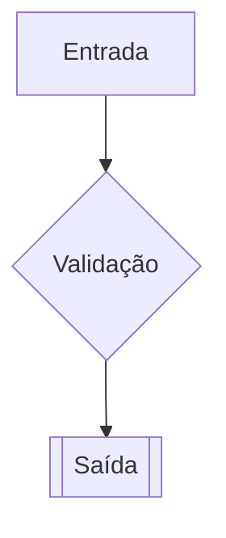
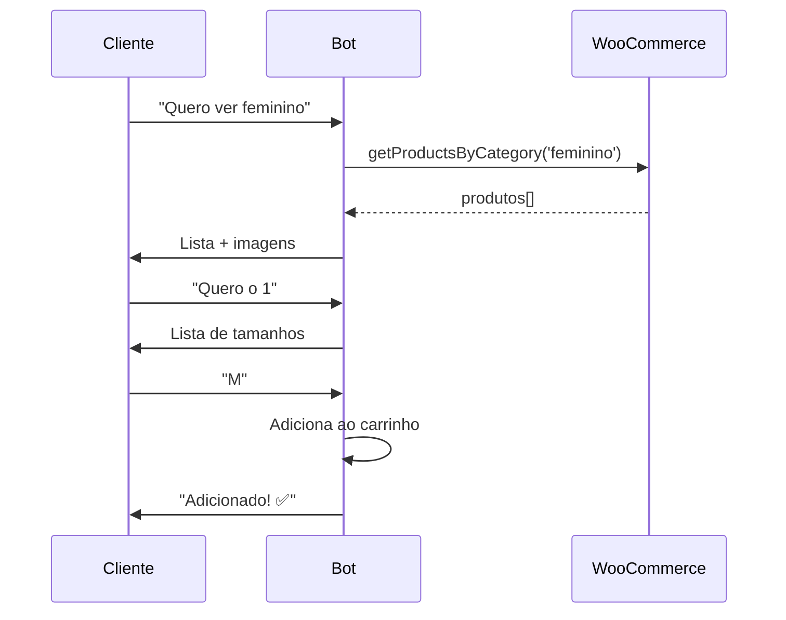

# Obsidian — Referência Completa

> Vault de documentação do Agente Belux · Fonte de verdade do projeto

---

## Sumário

1. [Localização do Vault](#localização-do-vault)
2. [Mapa de Arquivos](#mapa-de-arquivos)
3. [Template de Documento](#template-de-documento)
4. [Regras de Documentação](#regras-de-documentação)
5. [Diagramas Mermaid](#diagramas-mermaid)
6. [Protocolo por Tarefa](#protocolo-por-tarefa)
7. [Status Icons](#status-icons)
8. [Checklist de Validação](#checklist-de-validação)

---

## Localização do Vault

```
D:\obsidian\Agente Belux\Agente Belux Docs
```

**⚠️ Este é o caminho absoluto no Windows do Renan. Use exatamente este path ao ler/escrever arquivos no Obsidian.**

---

## Mapa de Arquivos

| Arquivo | Conteúdo | Conexões Típicas |
|---|---|---|
| `00 - Visão Geral.md` | Arquitetura, stack, mapa de arquivos | Hub central → todos os outros |
| `01 - Fluxo de Vendas.md` | Jornada completa do cliente | → 02, 03, 04, 05 |
| `02 - Webhook e Roteamento.md` | Payload Z-API, roteamento de eventos | → 04, 09 |
| `03 - Serviço WooCommerce.md` | Catálogo, categorias, funções | → 01, 05 |
| `04 - Serviço Z-API.md` | Tipos de mensagem, endpoints | → 02, 09 |
| `05 - Sessões e Carrinho.md` | Estado em memória, ciclo de vida | → 01, 03 |
| `06 - Configuração e Deploy.md` | Variáveis, scripts, ngrok | → 00 |
| `07 - Histórico e Migrações.md` | Decisões técnicas (ADRs) | → todos |
| `09 - Humanização e Eventos WhatsApp.md` | Visão completa de humanização, eventos Z-API, estratégias | → 02, 04 |

### Regra de Numeração

- Documentos numerados sequencialmente: `00`, `01`, `02`...
- Número pula se arquivo foi removido (ex: não existe `08`)
- Novos documentos recebem o próximo número disponível

---

## Template de Documento

Ao criar ou editar qualquer arquivo no vault, **siga este template obrigatoriamente**:

```markdown
# 🧩 [Nome do Componente]

**Status:** 🟢 Estável | 🟡 Em Desenvolvimento | 🔴 Legado
**Arquivo:** `caminho/arquivo.js`
**Conexões:** [[Link 1]], [[Link 2]]

## Responsabilidades
- O que faz
- O que NÃO faz

## Regras Críticas
- Regras invioláveis no código

## Diagrama


## Changelog
- YYYY-MM-DD: Descrição da mudança
```

### Campos Obrigatórios

| Campo | Descrição | Exemplo |
|---|---|---|
| Título com emoji | Identifica visualmente | `# 🧩 Serviço Z-API` |
| Status | Estado atual do componente | `🟢 Estável` |
| Arquivo | Caminho do código relacionado | `services/zapi.js` |
| Conexões | Links wiki para docs relacionados | `[[02 - Webhook e Roteamento]]` |
| Responsabilidades | O que faz e não faz | Lista de bullet points |
| Regras Críticas | Invariantes do código | Lista de bullet points |
| Diagrama | Fluxo visual em Mermaid | `graph TD;` |

---

## Regras de Documentação

### Obrigatórias (Guardrails)

1. **Nunca apague** um arquivo do Obsidian sem perguntar ao Renan.
2. **Nunca deixe doc órfão** — todo arquivo novo deve ser linkado em pelo menos um existente.
3. **Nunca assuma** — se não está no Obsidian, pergunte.
4. **Sempre atualize** no mesmo turno que o código muda.
5. **Sempre use links wiki** `[[Nome do Doc]]` para conectar documentos.
6. **Sempre use diagramas Mermaid** para fluxos.

### Boas Práticas

- Comece lendo os docs relacionados e seguindo os links `[[ ]]` antes de codificar.
- Se houver discrepância entre código e Obsidian → **Obsidian tem prioridade** (regras de negócio).
- Decisões técnicas importantes → ADR em `07 - Histórico e Migrações.md`.
- Ao criar módulo novo → crie doc correspondente e linke no pai.

### Formato de ADR (Architectural Decision Record)

```markdown
### ADR-NNN: Título Curto (YYYY-MM-DD)

**Contexto:** Por que essa decisão foi necessária?

**Decisão:** O que foi decidido?

**Consequências:**
- ✅ Benefício 1
- ✅ Benefício 2
- ❌ Trade-off 1
- ❌ Trade-off 2
```

---

## Diagramas Mermaid

### Tipos Suportados pelo Obsidian

| Tipo | Uso | Sintaxe |
|---|---|---|
| `graph TD` | Fluxos top-down | `A --> B --> C` |
| `graph LR` | Fluxos left-right | `A --> B --> C` |
| `sequenceDiagram` | Interações entre componentes | `A->>B: mensagem` |
| `stateDiagram-v2` | Estados e transições | `[*] --> Estado1` |
| `erDiagram` | Relacionamentos de dados | `USER \|\|--o{ ORDER` |

### Exemplos para o Projeto

**Fluxo de Webhook:**
```mermaid
graph TD;
  A[WhatsApp] -->|msg| B[Z-API];
  B -->|POST| C[/webhook];
  C --> D{Validação};
  D -->|OK| E[Groq IA];
  E --> F[Resposta + Action];
  F --> G[Z-API sendText];
```

**Sequência de Compra:**


---

## Status Icons

| Icon | Significado | Quando usar |
|---|---|---|
| 🟢 | Estável | Código funcional, testado, em produção |
| 🟡 | Em Desenvolvimento | Sendo implementado ou refatorado |
| 🔴 | Legado | Código antigo, será substituído |
| ⚠️ | Atenção | Requer cuidado especial ou tem bug conhecido |

---

## Checklist de Validação

Antes de finalizar qualquer turno de desenvolvimento, verifique:

- [ ] Código atualizado?
- [ ] Docs do Obsidian atualizados no mesmo turno?
- [ ] Novo módulo? → Novo doc criado e linkado?
- [ ] Decisão técnica importante? → ADR criado em `07`?
- [ ] Doc tem Status, Arquivo, Conexões?
- [ ] Doc tem pelo menos 1 link wiki `[[ ]]`?
- [ ] Diagrama Mermaid atualizado se fluxo mudou?
- [ ] Nenhum segredo exposto no código ou docs?
