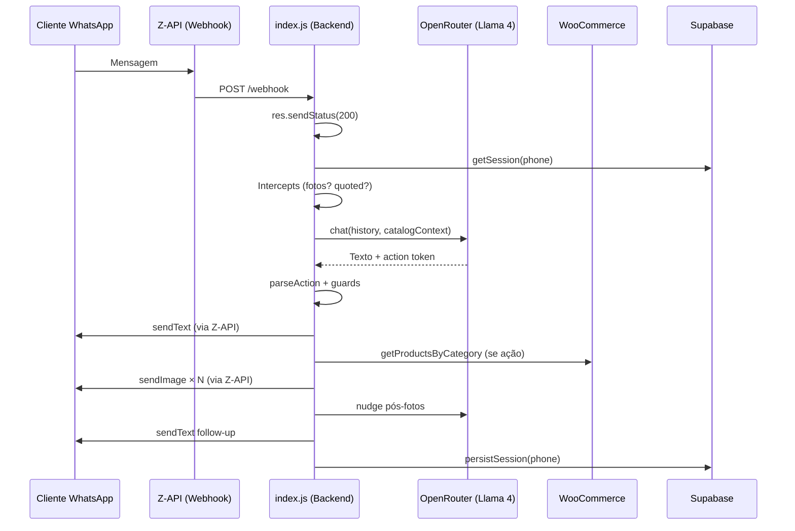

# SKILL — Catálogo WooCommerce ↔ WhatsApp (Z-API) ↔ IA (OpenRouter)
# Agente Belux · Lume Soluções · v2 — Baseada no código real (commit c815908)

> **Objetivo:** Skill cirúrgica para o Claude Code. Cobre 100% da conexão entre
> WooCommerce REST API v3, Z-API (WhatsApp SaaS) e OpenRouter (Llama 4 Maverick),
> com persistência em Supabase e sistema de aprendizados.

---

## Arquitetura real do projeto (27/03/2026)

```
Agente Belux/
├── index.js                 ← Webhook, sessões, executor de ações, fluxos
├── services/
│   ├── openrouter.js        ← IA: Llama 4 Maverick via OpenRouter (axios direto)
│   ├── woocommerce.js       ← Catálogo: paginação, busca, formatação, contexto
│   ├── zapi.js              ← WhatsApp: texto, imagem, áudio, read receipt
│   ├── supabase.js          ← Persistência: sessões, learnings, pedidos
│   ├── learnings.js         ← Sistema de aprendizados (RAG simples)
│   ├── gemini.js            ← TTS: voz da Bela via Gemini
│   ├── tts.js               ← Orchestrador TTS
│   └── groq.js              ← Standby (não usado no fluxo principal)
├── data/                    ← Scripts auxiliares (Python)
├── .env                     ← Credenciais
├── Dockerfile               ← Deploy via Docker
└── docker-compose.yaml
```



---

## VARIÁVEIS DE AMBIENTE

```env
# WooCommerce REST API v3
WC_BASE_URL=https://seusite.com/wp-json/wc/v3
WC_CONSUMER_KEY=ck_xxxxx
WC_CONSUMER_SECRET=cs_xxxxx

# Z-API (WhatsApp SaaS)
ZAPI_INSTANCE_ID=xxx
ZAPI_TOKEN=xxx
ZAPI_CLIENT_TOKEN=xxx

# OpenRouter (IA — Llama 4 Maverick)
OPENROUTER_API_KEY=sk-or-v1-xxxxx

# Supabase (sessões + learnings + pedidos)
SUPABASE_URL=https://xxx.supabase.co
SUPABASE_ANON_KEY=eyJxxx

# Gemini TTS (opcional)
GEMINI_API_KEY=AIzaSy_xxx
TTS_ENABLED=false
TTS_VOICE=Aoede

# Servidor
PORT=3000
ADMIN_PHONE=5585999999999
```

---

## PARTE 1 — Z-API (services/zapi.js)

### Endpoints implementados

| Função | Endpoint Z-API | Uso |
|---|---|---|
| `sendText(to, msg)` | `POST /send-text` | Envia texto com `delayTyping` proporcional |
| `sendImage(to, url, caption)` | `POST /send-image` | Envia imagem com legenda |
| `sendAudio(to, buffer, mime)` | `POST /send-audio` | Envia áudio base64 (TTS) |
| `readMessage(phone, messageId)` | `POST /read-message` | Marca mensagem como lida |
| `delay(ms)` | — | Pausa entre envios (evita flood/ban) |

### Comportamento real

```javascript
// delayTyping: simula digitação proporcional ao tamanho da mensagem
const typingSeconds = Math.min(Math.max(Math.ceil(message.length / 80), 1), 5);
// Resultado: msg de 160 chars → 2s de typing; msg de 400 chars → 5s (cap)
```

### Regras Z-API

- **SEMPRE** retornar `200` imediatamente no webhook antes de processar
- **400ms de delay** entre envios de imagem (`zapi.delay(400)`)
- **500ms de delay** entre fotos de galeria (`zapi.delay(500)`)
- Client-Token é opcional mas recomendado (segurança)
- Z-API faz retry se não receber 200 rápido
- Mensagem `fromMe: true` → ignorar (loop infinito)
- Mensagem de grupo, broadcast, status reply → ignorar
- Eventos `DeliveryCallback` e `ReadCallback` → ignorar

### Payload do webhook recebido

```javascript
// Mensagem de texto
{ phone: '5585999...', fromMe: false, text: { message: '...' }, messageId: 'xxx' }

// Mensagem com imagem
{ phone: '5585999...', image: { caption: '...' } }

// Mensagem citada (quoted)
{ phone: '5585999...', text: { message: '...' }, quotedMessage: {
    text: { message: '...' },       // ou
    image: { caption: '...' },      // ou
    imageMessage: { caption: '...' } // ou
    caption: '...'                   // depende da versão Z-API
  }
}
```

### Endpoints Z-API não implementados (disponíveis para uso futuro)

| Endpoint | Uso |
|---|---|
| `POST /send-button-list` | Botões interativos |
| `POST /send-option-list` | Lista de opções (select) |
| `POST /send-link` | Link com preview |
| `POST /send-video` | Vídeo |
| `POST /send-document/{ext}` | Documentos (PDF, etc.) |
| `POST /send-sticker` | Figurinhas |

---

## PARTE 2 — WooCommerce (services/woocommerce.js)

### Funções implementadas

| Função | Parâmetros | Retorno |
|---|---|---|
| `getProductsByCategory(slug, perPage, page)` | slug, 10, 1 | `{products, page, totalPages, total, hasMore}` |
| `searchProducts(query, perPage)` | termo, 20 | `Product[]` |
| `formatPrice(price)` | string/number | `"R$ 49,90"` |
| `buildCaption(product, number)` | product, idx | Caption para imagem WhatsApp |
| `buildCatalogContext(session)` | session | String de contexto para IA |

### Paginação real (headers WooCommerce)

```javascript
// WooCommerce retorna metadados nos headers HTTP:
const total = parseInt(response.headers['x-wp-total'] || '0', 10);
const totalPages = parseInt(response.headers['x-wp-totalpages'] || '1', 10);
// hasMore = page < totalPages
```

### formatProduct — estrutura completa

```javascript
{
  id: 123,
  name: "Calcinha Renda Floral",
  price: "39.90",
  regularPrice: "49.90",
  salePrice: "39.90",
  imageUrl: "https://belux.com.br/.../foto1.jpg",  // 1ª foto (thumbnail)
  images: [                                          // TODAS as fotos
    "https://belux.com.br/.../foto1.jpg",
    "https://belux.com.br/.../foto2.jpg",
    "https://belux.com.br/.../foto3.jpg"
  ],
  sizes: ["P", "M", "G", "GG"],
  permalink: "https://belux.com.br/produto/...",
  description: "Calcinha em renda com acabamento..."  // short_description limpo
}
```

### buildCatalogContext — o que a IA recebe

```
CATEGORIA: feminino
PÁGINA: 1 de 20

1. Kit c/ 5 calcinhas — R$ 39,90 — Tamanhos: P, M, G — Fotos disponíveis: 3
2. Conjunto sem bojo com aro — R$ 17,00 — Tamanhos: P, M, G, GG — Fotos disponíveis: 1
...
⚠️ Há mais ~190 produtos não mostrados. Use [PROXIMOS] para avançar.
```

### Parâmetros WooCommerce REST API v3

| Param | Tipo | Uso |
|---|---|---|
| `category` | int | Filtro por ID de categoria |
| `per_page` | int | Max 100 (usamos 10) |
| `page` | int | Página atual |
| `status` | string | `publish` |
| `stock_status` | string | `instock` |
| `search` | string | Busca por termo |
| `orderby` | string | `popularity` (padrão) |
| `order` | string | `desc` |
| `min_price` / `max_price` | string | Faixa de preço |

---

## PARTE 3 — OpenRouter (services/openrouter.js)

### Configuração real

```javascript
const OPENROUTER_BASE_URL = 'https://openrouter.ai/api/v1';
const OPENROUTER_MODEL = 'meta-llama/llama-4-maverick';

// Chamada via axios direto (NÃO usa openai npm)
const response = await axios.post(`${OPENROUTER_BASE_URL}/chat/completions`, {
  model: OPENROUTER_MODEL,
  messages,
  temperature: 0.2,      // Baixa — reduz alucinação
  max_tokens: 400,
  top_p: 0.85,
  frequency_penalty: 0.3, // Evita repetição
}, {
  headers: {
    'Authorization': `Bearer ${process.env.OPENROUTER_API_KEY}`,
    'Content-Type': 'application/json',
    'HTTP-Referer': 'https://belux.com.br',
    'X-Title': 'Agente Belux',
  },
  timeout: 20000,
});
```

### System prompt real (persona Bela)

**Contexto:** B2B atacado — quem fala é lojista profissional, nunca consumidor final.

**Protocolo `<think>`:** Antes de cada resposta, a IA raciocina em silêncio dentro de `<think>...</think>`:
- O que essa mensagem sinaliza?
- Esse lojista está quente ou frio?
- Qual é o próximo passo que move ele para a frente?
- Que token de ação se aplica?

O bloco `<think>` é extraído via regex e logado no console para debug. Nunca enviado ao cliente.

### Action tokens (10 tokens)

| Token | Regex | Quando usar |
|---|---|---|
| `[VER:feminino]` | `/\[VER:(feminino\|masculino\|infantil)\]/i` | Cliente quer ver categoria |
| `[BUSCAR:termo]` | `/\[BUSCAR:([^\]]+)\]/i` | Cliente busca por nome/termo |
| `[PROXIMOS]` | `/\[PROXIMOS\]/i` | Próxima página de produtos |
| `[FOTOS:N]` | `/\[FOTOS:(\d+)\]/i` | Ver mais fotos do produto N |
| `[SELECIONAR:N]` | `/\[SELECIONAR:(\d+)\]/i` | Cliente escolheu produto N |
| `[TAMANHO:N]` | `/\[TAMANHO:(\d+)\]/i` | Cliente escolheu tamanho N |
| `[CARRINHO]` | `/\[CARRINHO\]/i` | Ver carrinho |
| `[REMOVER:N]` | `/\[REMOVER:(\d+)\]/i` | Remover item N do carrinho |
| `[HANDOFF]` | `/\[HANDOFF\]/i` | Passar para consultora humana |

### sanitizeVisible — limpeza de tokens do texto visível

Remove TODOS os tokens via regex antes de enviar ao cliente. Também remove:
- Blocos `<think>` (fechados ou abertos sem fechar)
- Frases como "não posso emitir [TOKEN]..."
- Espaços duplicados

### Learnings injetados no prompt

```
━━━━━━━━━━━━━━━━━━━━━━━━
APRENDIZADOS DE CONVERSAS REAIS
━━━━━━━━━━━━━━━━━━━━━━━━
1. Lojistas de Fortaleza preferem pijamas com estampas regionais
2. Kit c/ 5 calcinhas é o produto mais pedido no atacado
...
```

---

## PARTE 4 — Sessão (index.js)

### Schema real

```javascript
{
  history: [],           // [{role, content}] — max 20 (slice)
  items: [],             // Carrinho: [{productId, productName, size, price}]
  products: [],          // Todos os produtos já vistos (acumulados entre páginas)
  currentProduct: null,  // Produto aguardando escolha de tamanho
  customerName: null,    // Nome do lojista (quando identificado)
  currentCategory: null, // Slug da categoria em exibição
  currentPage: 0,        // Última página carregada
  totalPages: 1,         // Total de páginas da categoria
  totalProducts: 0,      // Total de produtos da categoria no WC
  lastActivity: Date.now(), // Timestamp para timeout
}
```

### Persistência dupla (memória + Supabase)

```
1. getSession(phone)    → Tenta memória → fallback Supabase
2. (processo webhook)
3. persistSession(phone) → Salva no Supabase (async, não bloqueia)
```

### Session timeout

- 30 minutos de inatividade → limpa memória
- setInterval a cada 10min verifica sessões expiradas
- Supabase também limpa sessões expiradas

### Tabelas Supabase

| Tabela | Campos principais |
|---|---|
| `sessions` | phone (PK), history, items, products, current_product, customer_name, current_category, current_page, total_pages, total_products, last_activity, updated_at |
| `learnings` | id, insight, uses, added_at, last_seen |
| `orders` | phone, customer_name, items, total, status |

---

## PARTE 5 — Guards anti-alucinação (index.js)

### Guard 1: categoria + pergunta
```javascript
// Se a IA pergunta "qual categoria?" E ao mesmo tempo dispara [VER:xxx], descarta o token.
const askingForCategory = action && (action.type === 'VER' || action.type === 'BUSCAR')
  && cleanText.includes('?')
  && /qual.*categoria|que tipo|qual.*linha/i.test(cleanText);
if (askingForCategory) action = null;
```

### Guard 2: ação de catálogo limpa texto
```javascript
// Quando VER/BUSCAR/PROXIMOS vai mostrar produtos, qualquer texto da IA é ruído.
if (action && ['VER', 'BUSCAR', 'PROXIMOS'].includes(action.type)) {
  cleanText = '';
}
```

### Guard 3: lista inventada
```javascript
// Se a IA gera lista numerada com preços → está inventando catálogo → descarta.
const hasNumberedItems = (cleanText.match(/^\s*\d+[\.\)]\s+\S/mg) || []).length >= 2;
const hasPrices = /R\s*\\?\$\s*\d|reais|\d+[,\.]\d{2}/i.test(cleanText);
if (hasNumberedItems && hasPrices) cleanText = '';
```

### Guard 4: filtro de mensagens Z-API trial
```javascript
if (text.includes('CONTA EM TRIAL') || text.includes('MENSAGEM DE TESTE')) return;
```

### Guard 5: intercepção de pedido de fotos
```javascript
// Antes de chamar a IA, intercepta pedidos de foto direto no código.
const IS_PHOTO_REQUEST = /mais foto|ver foto|outra foto|tem foto|foto dela|foto dis/i.test(text);

// Tenta resolver por:
// 1. Número do produto na legenda citada (quotedMessage)
// 2. Número inline no texto ("foto da 3")
// 3. Se não encontra → pede o número ao cliente (fallback)
```

---

## PARTE 6 — Fluxos de ação (index.js)

### VER → showCategory
```
1. sendText("🔍 Buscando...")
2. woocommerce.getProductsByCategory(slug, 10, 1)
3. Atualiza sessão: products, currentCategory, currentPage, totalPages, totalProducts
4. sendProductPage → lista numerada + imagens com caption
5. Nudge pós-fotos via IA ("Algum chamou atenção?")
```

### PROXIMOS → showNextPage
```
1. Verifica se há mais páginas
2. woocommerce.getProductsByCategory(slug, 10, nextPage)
3. Acumula: session.products = [...session.products, ...result.products]
4. sendProductPage com startIdx correto (numeração contínua)
```

### FOTOS → showProductPhotos
```
1. Busca product em session.products[index - 1]
2. Se images.length <= 1 → responde humanizada aleatória ("Só temos uma foto...")
3. Se images.length > 1 → envia todas com delay(500ms)
4. Follow-up fixo humanizado (sem chamar IA — evita resposta robótica)
```

### BUSCAR → searchAndShowProducts
```
1. sendText("🔍 Buscando...")
2. woocommerce.searchProducts(query)
3. Atualiza session.products
4. Envia lista + imagens
```

### SELECIONAR → selectProduct
```
1. Busca product em session.products[idx - 1]
2. session.currentProduct = product
3. showSizes → lista numerada de tamanhos
```

### TAMANHO → selectSize
```
1. Valida session.currentProduct existe
2. Valida sizeIdx válido
3. Adiciona ao carrinho: session.items.push({...})
4. session.currentProduct = null
5. Nudge via IA com contexto do carrinho
```

### REMOVER → removeItem
```
1. session.items.splice(itemIdx, 1)
2. Mostra carrinho atualizado
```

### HANDOFF → handoffToConsultant
```
1. Gera bloco de pedido formatado
2. Envia ao ADMIN_PHONE via Z-API
3. Salva pedido no Supabase (status: 'pending')
```

---

## PARTE 7 — O ÚNICO BUG RESTANTE + FIX

### Bug: "tem mais foto dessa?" sem número

**Cenário:**
```
Bot envia 10 imagens com captions numeradas
Cliente: "tem mais foto dessa?"  (sem citar mensagem, sem número)
Bot: "Me diz o número da peça..." (pede clarificação)
```

**Causa:** O intercept de fotos tenta resolver por:
1. `quotedMessage` → Z-API nem sempre envia
2. Número inline no texto → não há

Não existe `lastViewedProduct` na sessão.

### Fix cirúrgico: 3 pontos de mudança

**1. Schema da sessão — adicionar lastViewedProduct (index.js + supabase.js)**

```javascript
// Em getSession (index.js) — adicionar ao objeto:
lastViewedProduct: stored?.last_viewed_product || null,

// Em createSession (quando não há stored):
lastViewedProduct: null,
```

**2. Atualizar lastViewedProduct a cada imagem enviada (index.js)**

```javascript
// Em sendProductPage — após enviar a última imagem:
if (result.products.length > 0) {
  session.lastViewedProduct = result.products[result.products.length - 1];
  session.lastViewedProductIndex = startIdx + result.products.length;
}

// Em showProductPhotos — após enviar fotos:
session.lastViewedProduct = product;
session.lastViewedProductIndex = index;
```

**3. Usar lastViewedProduct no intercept de fotos (index.js)**

```javascript
// Após a checagem de quotedProductIdx e inlineNum, ANTES do fallback:
if (IS_PHOTO_REQUEST && !quotedProductIdx && session.lastViewedProduct) {
  const idx = session.lastViewedProductIndex || 1;
  console.log(`[LastViewed] Produto #${idx} — "${session.lastViewedProduct.name}"`);
  await showProductPhotos(from, idx, session);
  if (session.history.length > 20) session.history = session.history.slice(-20);
  persistSession(from);
  return;
}
```

**4. Supabase — adicionar campo na tabela sessions**

```sql
ALTER TABLE sessions ADD COLUMN IF NOT EXISTS last_viewed_product jsonb DEFAULT null;
ALTER TABLE sessions ADD COLUMN IF NOT EXISTS last_viewed_product_index integer DEFAULT null;
```

**5. upsertSession — incluir campo (supabase.js)**

```javascript
// Adicionar ao objeto de upsert:
last_viewed_product: session.lastViewedProduct,
last_viewed_product_index: session.lastViewedProductIndex,
```

### Resultado após o fix

```
Bot envia 10 imagens (última = produto #7 "Kit c/ 5 calcinhas")
session.lastViewedProduct = produto #7
session.lastViewedProductIndex = 7

Cliente: "tem mais foto dessa?"
→ Intercept detecta IS_PHOTO_REQUEST
→ Sem quotedProductIdx, sem inlineNum
→ USA session.lastViewedProduct (#7)
→ showProductPhotos(phone, 7, session)
→ Envia todas as fotos do produto #7 automaticamente
```

---

## PARTE 8 — Testes de validação

### Teste 1 — "tem mais foto dessa?" (bug corrigido)
```
→ Bot envia 10 produtos com fotos
→ Cliente: "tem mais foto dessa?"
✅ Mostra fotos do último produto exibido (sem pedir número)
```

### Teste 2 — "foto da 3" (já funciona)
```
→ Cliente: "foto da 3"
✅ Intercept extrai 3 do texto inline → showProductPhotos(3)
```

### Teste 3 — Quoted message (já funciona)
```
→ Cliente cita imagem do produto 5 + "tem mais?"
✅ Intercept extrai 5 da caption citada → showProductPhotos(5)
```

### Teste 4 — Guard de lista inventada
```
→ IA gera lista com preços inventados
✅ Guard detecta e descarta texto (cleanText = '')
```

### Teste 5 — Guard de categoria
```
→ IA pergunta "Qual categoria?" + [VER:feminino]
✅ Guard descarta token, só envia a pergunta
```

### Teste 6 — Paginação
```
→ "ver mais" após mostrar 10 produtos
✅ Mostra 11-20 com numeração contínua
✅ Products acumulados (1-10 acessíveis por índice)
```

### Teste 7 — HANDOFF
```
→ "finalizar" com carrinho cheio
✅ Envia bloco de pedido ao ADMIN_PHONE
✅ Salva order no Supabase (status: pending)
```

---

## REFERÊNCIA RÁPIDA — imports no index.js

```javascript
const woocommerce = require('./services/woocommerce');
const zapi = require('./services/zapi');
const groq = require('./services/openrouter');  // Alias "groq" por legado
const tts = require('./services/tts');
const db = require('./services/supabase');
```

⚠️ **Atenção:** `groq` no index.js é na verdade `openrouter.js`. O require aponta para o arquivo correto, o nome é legado da migração Groq → OpenRouter.

---

## CHECKLIST DE IMPLEMENTAÇÃO DO FIX

- [ ] `index.js` → Adicionar `lastViewedProduct` e `lastViewedProductIndex` ao schema de sessão
- [ ] `index.js` → Atualizar `lastViewedProduct` em `sendProductPage` e `showProductPhotos`
- [ ] `index.js` → Adicionar checagem de `lastViewedProduct` no intercept de fotos (antes do fallback)
- [ ] `services/supabase.js` → Adicionar campos no `upsertSession`
- [ ] Supabase SQL → `ALTER TABLE sessions ADD COLUMN last_viewed_product jsonb...`
- [ ] Testar cenário "tem mais foto dessa?" sem número
- [ ] Testar cenário com número inline (não deve quebrar)
- [ ] Testar cenário com quoted message (não deve quebrar)
