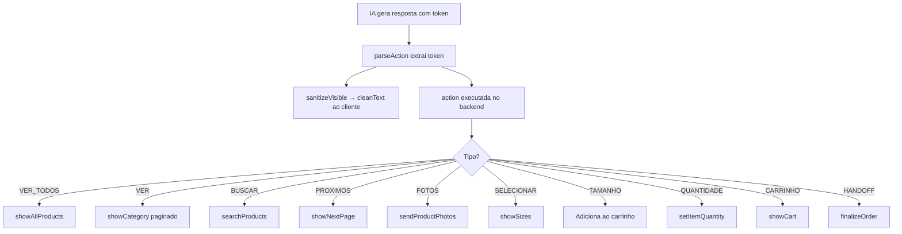
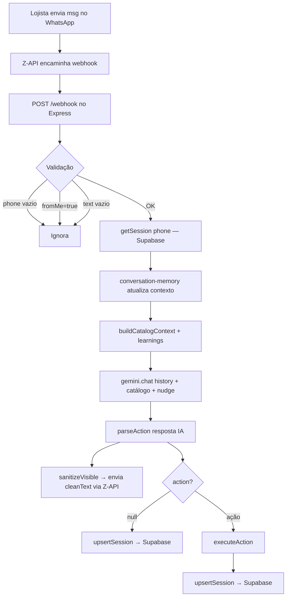
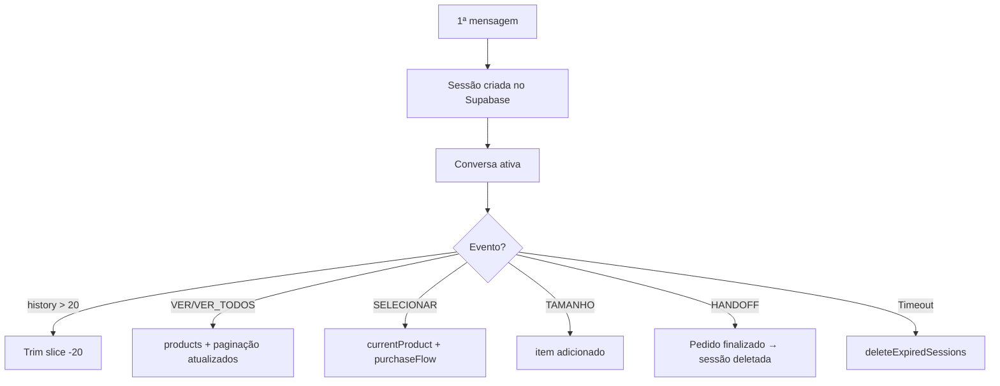
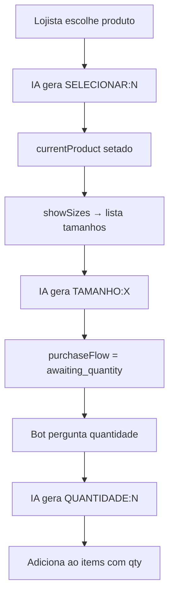

# Correção de Encoding — Skill agente-belux

## O problema

O PowerShell escreveu os arquivos com double-encoding: os caracteres UTF-8 (ã, ç, é, —, ✅, etc.) ficaram corrompidos (ex: `â€"` em vez de `—`, `Ãntima` em vez de `Íntima`).

## Caminho da pasta no Windows

```
C:\Users\renan\AppData\Local\Packages\Claude_pzs8sxrjxfjjc\LocalCache\Roaming\Claude\local-agent-mode-sessions\skills-plugin\919fbe56-457c-4235-b83f-8107ce5ac870\accbf69a-a60c-40b5-8622-8b15bcbad058\skills\agente-belux\
```

## Arquivos que precisam ser corrigidos

Abra cada arquivo no VS Code (ou Notepad++), selecione tudo (`Ctrl+A`) e substitua pelo conteúdo abaixo. Salve como **UTF-8 sem BOM**.

Os arquivos `references/obsidian.md`, `references/woocommerce.md` e `references/zapi.md` **não foram tocados** — estão corretos.

---

## 1. `SKILL.md`

```markdown
---
name: agente-belux
description: >
  Skill mestre do projeto Agente Belux — bot de vendas WhatsApp para Belux Moda Íntima,
  desenvolvido pela Lume Soluções. Cobre Z-API (webhooks, eventos, envio de mensagens),
  WooCommerce REST API (catálogo, categorias, produtos), Gemini 2.5 Flash (IA ativa, prompts,
  action tokens), Supabase (persistência de sessões, learnings, pedidos), ElevenLabs TTS,
  arquitetura Node.js/Express, sessões persistidas, carrinho de compras, e documentação
  no Obsidian. USE ESTA SKILL SEMPRE que o contexto envolver: WhatsApp bot, Z-API,
  WooCommerce, Gemini, Supabase, Belux, moda íntima, agente de vendas, webhook, catálogo de
  produtos, carrinho, sessão de cliente, Obsidian vault do projeto, ou qualquer tarefa
  de desenvolvimento, debug, refatoração ou documentação do Agente Belux. Mesmo que o
  usuário não mencione "Belux" explicitamente — se a tarefa envolve bot de WhatsApp com
  WooCommerce neste workspace, esta skill se aplica.
---

# Agente Belux — Skill Mestre

> Bot de vendas WhatsApp B2B para **Belux Moda Íntima** · Lume Soluções
> Stack: Node.js · Express 5 · Z-API · WooCommerce REST · Gemini 2.5 Flash · Supabase · ElevenLabs TTS

---

## Mapa do Projeto

```
Agente Belux/
├── index.js                      ← Servidor Express, webhook, lógica do bot
├── services/
│   ├── gemini.js                 ← IA Bela: chat(), parseAction() — ATIVO (gemini-2.5-flash)
│   ├── zapi.js                   ← Envio de mensagens via Z-API (WhatsApp SaaS)
│   ├── woocommerce.js            ← Catálogo de produtos via WooCommerce REST
│   ├── supabase.js               ← Persistência: sessões, learnings, pedidos (Supabase)
│   ├── learnings.js              ← Sistema de aprendizados dinâmicos (RAG leve)
│   ├── conversation-memory.js    ← Memória de conversa estruturada (preferências, objeções)
│   ├── tts.js                    ← Text-to-Speech via ElevenLabs (feature flag)
│   └── logger.js                 ← Logger estruturado (pino)
├── src/handlers/                 ← Handlers de ações do webhook
├── .env                          ← Credenciais (NUNCA versionar)
├── .env.example                  ← Modelo de variáveis (versionado)
├── .claude/CLAUDE.md             ← Instruções do Claude
├── Dockerfile                    ← Imagem Docker de produção
├── docker-compose.yaml           ← Orquestração de containers
├── MIGRATION.md                  ← Histórico técnico
└── Obsidian Vault                ← D:\obsidian\Agente Belux\Agente Belux Docs
```

---

## Roteamento de Referências

**Leia APENAS a referência necessária para a tarefa atual.** Isso economiza tokens.

| Tarefa / Contexto | Referência | Quando carregar |
|---|---|---|
| Webhook, envio de mensagens, payloads WhatsApp | `references/zapi.md` | Qualquer coisa envolvendo Z-API, mensagens, webhook, eventos |
| Catálogo, produtos, categorias, preços | `references/woocommerce.md` | Busca de produtos, formatação de preço, categorias |
| IA, prompts, action tokens, Gemini, parsing | `references/gemini.md` | System prompt, temperatura, parsing de ações, modelo ativo |
| Persistência, sessões no banco, learnings, pedidos | `references/supabase.md` | Supabase, estrutura de sessão persistida, orders |
| Arquitetura geral, fluxo, carrinho, FSM | `references/arquitetura.md` | Visão geral, fluxo de venda, estado da sessão, actions |
| Text-to-Speech, áudio WhatsApp | `references/tts.md` | ElevenLabs, envio de áudio, feature flag TTS |
| Documentação, vault Obsidian, templates | `references/obsidian.md` | Criar/editar docs no Obsidian, padrões de documentação |

**Exemplos:**
- "Corrigir envio de imagem no WhatsApp" → leia `references/zapi.md`
- "Adicionar nova categoria ao catálogo" → leia `references/woocommerce.md` + `references/gemini.md`
- "Debug de sessão perdida após restart" → leia `references/supabase.md` + `references/arquitetura.md`
- "Ajustar tom da Bela / persona" → leia `references/gemini.md`

---

## Variáveis de Ambiente (`.env`)

```env
# Z-API (WhatsApp)
ZAPI_INSTANCE_ID=            # ID da instância no painel Z-API
ZAPI_TOKEN=                  # Token da instância
ZAPI_CLIENT_TOKEN=           # Client token (segurança extra)

# WooCommerce
WC_BASE_URL=                 # Ex: https://belux.com.br/wp-json/wc/v3
WC_CONSUMER_KEY=             # ck_xxxxx
WC_CONSUMER_SECRET=          # cs_xxxxx

# Gemini (IA ativa)
GEMINI_API_KEY=              # AIzaSy_xxxxx

# Supabase (persistência)
SUPABASE_URL=                # https://xxxxx.supabase.co
SUPABASE_ANON_KEY=           # eyJxxxxx

# ElevenLabs (TTS — opcional, controlado por feature flag)
ELEVENLABS_API_KEY=          # sk_xxxxx
ELEVENLABS_VOICE_ID=         # ID da voz (painel ElevenLabs)
ELEVENLABS_MODEL_ID=         # eleven_multilingual_v2 (default)
ELEVENLABS_OUTPUT_FORMAT=    # mp3_44100_128 (default)
ELEVENLABS_STABILITY=        # 0.5 (default)
ELEVENLABS_SIMILARITY_BOOST= # 0.75 (default)
ELEVENLABS_STYLE=            # 0 (default)
ELEVENLABS_SPEED=            # 1 (default)
ELEVENLABS_USE_SPEAKER_BOOST=# true (default)

# Server
PORT=3000
```

**⚠️ NUNCA exponha essas chaves em código, logs ou commits.**

---

## Protocolo Obrigatório (TODO TURNO)

### 1. Antes de codificar
- Identifique quais referências desta skill são relevantes e leia-as.
- Se algo não está documentado aqui nem no Obsidian → **pergunte ao Renan**.

### 2. Durante o desenvolvimento
- Código limpo, modular, com tratamento de erros verboso.
- Variáveis e comentários de código em **inglês**.
- Respostas e comunicação em **português brasileiro**.

### 3. Após codificar (MESMO TURNO)
- Atualize os `.md` correspondentes no Obsidian vault.
- Se criou módulo novo → crie doc novo e linke no pai.
- Decisões técnicas importantes → ADR em `07 - Histórico e Migrações.md`.
- Atualize esta skill se a mudança afetar arquitetura, APIs ou fluxos.

---

## Guardrails

- ❌ Nunca apague arquivo do Obsidian sem perguntar.
- ❌ Nunca deixe doc sem links (sem órfãos).
- ❌ Nunca assuma — se não está documentado, pergunte.
- ❌ Nunca exponha chaves, tokens ou segredos.
- ❌ Nunca invente produtos — use apenas dados do WooCommerce.
- ✅ Sempre atualize Obsidian no mesmo turno que o código.
- ✅ Sempre use diagramas Mermaid para fluxos.
- ✅ Sempre teste action tokens com regex antes de deploy.

---

## Comandos Úteis

```bash
# Iniciar servidor (dev com hot-reload)
npm run dev

# Iniciar servidor (produção)
npm start

# Expor localhost para webhook (ngrok)
ngrok http 3000

# Testar health check
curl http://localhost:3000/
```

---

## Dependências

| Pacote | Versão | Uso |
|---|---|---|
| `express` | ^5.2.1 | Servidor HTTP + webhook |
| `axios` | ^1.13.6 | HTTP client (Z-API, WooCommerce) |
| `dotenv` | ^17.3.1 | Variáveis de ambiente |
| `@google/generative-ai` | ^0.24.0 | SDK oficial do Gemini (IA ativa) |
| `@supabase/supabase-js` | ^2.100.1 | Persistência: sessões, learnings, pedidos |
| `elevenlabs` | ^1.59.0 | Text-to-Speech via ElevenLabs |
| `pino` | ^10.3.1 | Logger estruturado de produção |
| `pino-pretty` | ^13.1.3 | Formatação de logs em desenvolvimento |

---

## Status Atual do Projeto

- ✅ Migração Evolution API → Z-API concluída
- ✅ Webhook recebendo mensagens
- ✅ IA conversacional (Gemini 2.5 Flash) funcional — B2B (lojistas atacado)
- ✅ Catálogo WooCommerce integrado com paginação
- ✅ Sessões persistidas no Supabase (sobrevivem a restarts)
- ✅ Sistema de learnings dinâmicos (RAG leve via Supabase)
- ✅ Memória de conversa estruturada (preferências, objeções, estágio)
- ✅ Logger estruturado com pino
- ✅ ElevenLabs TTS integrado (feature flag)
- ✅ Envio de texto, imagem e áudio via Z-API
- ✅ Handoff visual com fotos para a consultora (1 foto por produto distinto)
- 🟡 Integração de pedidos no WooCommerce Orders (planejado)
- 🟡 Link de pagamento PIX (planejado)
```

---

## 2. `references/gemini.md` (arquivo novo)

```markdown
# Gemini — Referência Completa

> IA conversacional ativa do Agente Belux · Modelo: gemini-2.5-flash via Google Generative AI SDK
> **Arquivo:** `services/gemini.js`

---

## Sumário

1. [Configuração](#configuração)
2. [Persona e System Prompt](#persona-e-system-prompt)
3. [Action Tokens](#action-tokens)
4. [Fluxo de Chat](#fluxo-de-chat)
5. [Parsing de Ações](#parsing-de-ações)
6. [Sanitização de Resposta](#sanitização-de-resposta)
7. [Parâmetros do Modelo](#parâmetros-do-modelo)
8. [Learnings Dinâmicos](#learnings-dinâmicos)

---

## Configuração

```env
GEMINI_API_KEY=AIzaSy_xxxxx
```

```javascript
const { GoogleGenerativeAI } = require('@google/generative-ai');
const genAI = new GoogleGenerativeAI(process.env.GEMINI_API_KEY);
```

---

## Persona e System Prompt

A persona da IA se chama **Bela** — melhor vendedora B2B da Belux, atende **lojistas no atacado**.

### Características principais da persona

| Aspecto | Detalhe |
|---|---|
| Público | Lojistas de atacado (B2B), não consumidor final |
| Tom | Calorosa, carismática, direta — como WhatsApp real |
| Anti-padrões | NUNCA "Olá!", "Com certeza", "Entendido", "Aqui está" |
| Liderança | Assume a condução — não espera o lojista guiar |
| Emojis | Moderados e realistas (😊, ✨, 🙌) |
| Produtos | NUNCA inventa — apenas os do catálogo da sessão |

### Protocolo de raciocínio interno

Antes de cada resposta, a IA pensa em silêncio dentro de um bloco `<think>...</think>`. O bloco é removido pelo `sanitizeVisible()` antes de enviar ao WhatsApp.

---

## Action Tokens

Apenas **1 token por resposta**, sempre ao final, em linha isolada.

| Token | Regex | Quando usar |
|---|---|---|
| `[VER_TODOS:categoria]` | `/\[VER_TODOS:([^\]]+)\]/i` | 1º contato — envia TODOS os produtos da categoria |
| `[VER:feminino]` | `/\[VER:(feminino\|masculino\|femininoinfantil\|masculinoinfantil\|infantil)\]/i` | Categoria específica |
| `[BUSCAR:termo]` | `/\[BUSCAR:([^\]]+)\]/i` | Busca por nome, cor ou tipo |
| `[PROXIMOS]` | `/\[PROXIMOS\]/i` | Próxima página de produtos |
| `[FOTOS:N]` | `/\[FOTOS:(\d+)\]/i` | Imagens do produto N |
| `[SELECIONAR:N]` | `/\[SELECIONAR:(\d+)\]/i` | Lojista quer o modelo N |
| `[TAMANHO:X]` | `/\[TAMANHO:([^\]]+)\]/i` | Tamanho escolhido (índice ou nome) |
| `[QUANTIDADE:N]` | `/\[QUANTIDADE:(\d+)\]/i` | Quantidade (apenas em awaiting_quantity) |
| `[CARRINHO]` | `/\[CARRINHO\]/i` | Ver resumo do carrinho |
| `[LIMPAR_CARRINHO]` | `/\[LIMPAR_CARRINHO\]/i` | Zerar o carrinho |
| `[REMOVER:N]` | `/\[REMOVER:(\d+)\]/i` | Remover item N |
| `[COMPRAR_DIRETO:{...}]` | JSON payload | Compra expressa (produto + tamanho + quantidade) |
| `[HANDOFF]` | `/\[HANDOFF\]/i` | Fechar o pedido final |

### Token especial: COMPRAR_DIRETO

```
[COMPRAR_DIRETO:{"productIdx":N,"size":"X","qty":Q}]
```

Se faltar tamanho ou quantidade, a IA deve PERGUNTAR — nunca emitir o token incompleto.

### Fluxo de ação



---

## Fluxo de Chat

```javascript
async function chat(history, catalogContext, nudge = null) {
  const active = await learnings.getActive(); // top 10 learnings dinâmicos
  const systemContent = [nudgeBlock, SYSTEM_PROMPT, learningsBlock, catalogContext]
    .filter(Boolean).join('\n\n');

  const model = genAI.getGenerativeModel({
    model: 'gemini-2.5-flash',
    systemInstruction: { parts: [{ text: systemContent }] },
    generationConfig: { temperature: 0.4, maxOutputTokens: 500 },
  });

  const geminiHistory = toGeminiHistory(history.slice(0, -1));
  const chatSession = model.startChat({ history: geminiHistory });
  const result = await chatSession.sendMessage(history.at(-1).content);
  return result.response.text().trim();
}
```

### Conversão de histórico

O Gemini usa roles `user` / `model` (não `assistant`). Mensagens consecutivas do mesmo role são fundidas.

---

## Parsing de Ações

```javascript
function parseAction(text) {
  // COMPRAR_DIRETO tem payload JSON — trata antes dos demais
  const tokens = {
    VER_TODOS, VER, BUSCAR, PROXIMOS, FOTOS,
    SELECIONAR, TAMANHO, QUANTIDADE,
    CARRINHO, LIMPAR_CARRINHO, REMOVER, HANDOFF,
  };
  // Retorna { cleanText, action: { type, payload } | null }
}
```

---

## Sanitização de Resposta

`sanitizeVisible()` remove do texto enviado ao cliente:
- Blocos `<think>...</think>` (raciocínio interno)
- Todos os action tokens
- Frases residuais do tipo "não posso emitir [TOKEN]..."

---

## Parâmetros do Modelo

| Parâmetro | Valor | Justificativa |
|---|---|---|
| `model` | `gemini-2.5-flash` | Rápido, custo-benefício, PT-BR nativo |
| `temperature` | `0.4` | Controlado — evita alucinações de produtos |
| `maxOutputTokens` | `500` | Suficiente para resposta + token de ação |

---

## Learnings Dinâmicos

Top 10 insights do Supabase (tabela `learnings`) injetados no system prompt a cada chamada. Veja `references/supabase.md`.
```

---

## 3. `references/groq.md` (atualizado para STANDBY)

```markdown
# Groq — Referência (STANDBY)

> ⚠️ **Este provider está em STANDBY.** A IA ativa do Agente Belux é o **Gemini 2.5 Flash**.
> Consulte `references/gemini.md` para a referência do provider atual.
>
> O arquivo `services/groq.js` foi removido do projeto — recrie a partir desta referência se precisar.

---

## Quando usar esta referência

Apenas se precisar **reativar ou reimplementar o Groq como fallback**. Para qualquer trabalho
normal no Agente Belux, use `references/gemini.md`.

---

## Configuração (se reativar)

```env
GROQ_API_KEY=gsk_xxxxx
```

```javascript
const Groq = require('groq-sdk');
const client = new Groq({ apiKey: process.env.GROQ_API_KEY });
```

**Instalar dependência:** `npm install groq-sdk`

---

## Modelo recomendado para fallback

| Modelo | Contexto | Observação |
|---|---|---|
| `llama-3.3-70b-versatile` | 128k | Melhor alternativa ao Gemini — PT-BR decente |
| `qwen/qwen3-32b` | 32k | Mais rápido (reasoning model — remove `<think>`) |

---

## Diferenças críticas vs. Gemini

| Aspecto | Groq | Gemini (atual) |
|---|---|---|
| SDK | `groq-sdk` | `@google/generative-ai` |
| Role history | `user` / `assistant` | `user` / `model` |
| System prompt | Via `messages[0]` com role `system` | Via `systemInstruction` separado |
| Bloco `<think>` | Apenas no qwen3-32b | Presente no Gemini 2.5 Flash |
| Temperature ideal | 0.7 | 0.4 |
| Max tokens | `max_completion_tokens` | `maxOutputTokens` |

---

## Interface mínima para compatibilidade

```javascript
module.exports = {
  chat(history, catalogContext, nudge),  // → string (resposta bruta)
  parseAction(text),                      // → { cleanText, action }
};
```

---

## Histórico de uso

- **Fase 1:** Groq + qwen3-32b foi o provider original do projeto.
- **Migração:** Substituído pelo Gemini 2.5 Flash — melhor PT-BR, temperatura mais controlada.
- **Status atual:** STANDBY — `services/groq.js` removido.
```

---

## 4. `references/arquitetura.md` (atualizado)

```markdown
# Arquitetura — Referência Completa

> Visão geral do fluxo, sessões persistidas, carrinho e execução de ações

---

## Sumário

1. [Fluxo Geral](#fluxo-geral)
2. [Sessões (Supabase)](#sessões-supabase)
3. [Carrinho de Compras](#carrinho-de-compras)
4. [Executor de Ações](#executor-de-ações)
5. [Finalização de Pedido](#finalização-de-pedido)
6. [Health Check](#health-check)
7. [Decisões Técnicas (ADRs)](#decisões-técnicas)

---

## Fluxo Geral



### Sequência Detalhada

1. Lojista envia mensagem no WhatsApp
2. Z-API faz POST no `/webhook`
3. Express responde `200` imediatamente
4. Validações: phone não vazio, não é `fromMe`, texto não vazio
5. Busca ou cria sessão no **Supabase**
6. `conversation-memory` processa (preferências, objeções, intenção)
7. Monta contexto de catálogo + learnings dinâmicos
8. Chama `gemini.chat`
9. `sanitizeVisible` remove `<think>` e tokens
10. `parseAction` extrai action token
11. Envia texto limpo via Z-API
12. Executa ação → persiste sessão no Supabase

---

## Sessões (Supabase)

Persistidas na tabela `sessions` — sobrevivem a restarts.

### Estrutura da sessão

```javascript
{
  phone: '5585999999999',
  history: [],                   // max 20 msgs
  items: [],                     // carrinho [{productId, productName, size, price, qty}]
  products: [],                  // produtos da página ativa
  currentProduct: null,
  customerName: null,
  currentCategory: null,
  currentPage: 1,
  totalPages: null,
  totalProducts: null,
  lastViewedProduct: null,
  lastViewedProductIndex: null,
  purchaseFlow: {
    state: 'idle',               // idle | selecting_size | awaiting_quantity | ...
    contextMemory: {...}
  },
  messageProductMap: {},
  lastActivity: timestamp,
}
```

### Funções (services/supabase.js)

```javascript
getSession(phone)            // → sessão | null
upsertSession(phone, data)   // cria ou atualiza
deleteExpiredSessions(ms)    // remove sessões inativas
```

### Ciclo de vida



---

## Carrinho de Compras

### Estrutura de Item

```javascript
{
  productId: 123,
  productName: "Calcinha Renda",
  size: "M",
  quantity: 3,
  unitPrice: 39.90,
  price: 119.70,       // subtotal = unitPrice * quantity
  imageUrl: "https://belux.com.br/.../calcinha.jpg", // ← persistido ao adicionar ao carrinho
}
```

> **imageUrl** é capturado de `session.products` no momento em que o item é adicionado (`addToCart`/`pushCartItem`), garantindo que a foto esteja disponível mesmo que o cliente navegue para outra categoria antes de finalizar.

### Fluxo de Adição



**Atalho:** `[COMPRAR_DIRETO:{"productIdx":2,"size":"G","qty":3}]`

---

## Executor de Ações

```javascript
async function executeAction(phone, action, session) {
  switch (action.type) {
    case 'VER_TODOS':       await showAllProducts(phone, action.payload, session); break;
    case 'VER':             await showCategory(phone, action.payload, session); break;
    case 'BUSCAR':          await searchProducts(phone, action.payload, session); break;
    case 'PROXIMOS':        await showNextPage(phone, session); break;
    case 'FOTOS':           await sendProductPhotos(phone, action.payload, session); break;
    case 'SELECIONAR':      await handleSelectProduct(phone, action.payload, session); break;
    case 'TAMANHO':         await handleSelectSize(phone, action.payload, session); break;
    case 'QUANTIDADE':      await handleSetQuantity(phone, action.payload, session); break;
    case 'CARRINHO':        await showCart(phone, session); break;
    case 'LIMPAR_CARRINHO': await clearCart(phone, session); break;
    case 'REMOVER':         await removeCartItem(phone, action.payload, session); break;
    case 'COMPRAR_DIRETO':  await addToCartDirect(phone, action.payload, session); break;
    case 'HANDOFF':         await finalizeOrder(phone, session); break;
  }
}
```

---

## Finalização de Pedido

Função `handoffToConsultant` em `index.js`. Fluxo completo:

```javascript
async function handoffToConsultant(phone, session) {
  // 1. Envia resumo em texto ao cliente (buildCartSummary)
  // 2. Envia ao admin (ADMIN_PHONE):
  //    2a. Header + resumo do pedido em texto
  //    2b. 1 imagem por produto distinto (buildProductGroupsFromCart)
  //        → caption: nome, tamanhos agrupados, subtotal
  //        → fallback texto se produto sem imageUrl
  //        → zapi.delay(400) entre envios (anti-flood)
  // 3. Salva no Supabase (tabela 'orders', status: 'pending')
  // 4. Reset purchaseFlow + handoffDone = true
}
```

### Helpers da finalização

| Função | Localização | O que faz |
|---|---|---|
| `buildCartSummary(session)` | `index.js:1585` | Monta texto resumo do carrinho |
| `buildProductGroupsFromCart(session)` | `index.js:1606` | Agrupa itens por productId para envio visual |
| `zapi.sendImage(to, imageUrl, caption)` | `services/zapi.js:51` | Envia foto com legenda via Z-API |
| `zapi.delay(ms)` | `services/zapi.js:86` | Pausa async para anti-flood |

**Status:** ✅ Implementado e validado em 2026-04-05
**Melhorias futuras:** criar pedido no WooCommerce, gerar link PIX.

---

## Health Check

```javascript
app.get('/', (_req, res) => {
  res.json({ status: 'online', service: 'Vendedor Digital - Belux Moda Íntima' });
});
```

---

## Decisões Técnicas

### ADR-001: Evolution API → Z-API
Migração para SaaS gerenciado. Sem Docker local, mais estável.

### ADR-002: Action Tokens no Prompt
Tokens no texto parseados com regex. Simples, funciona com qualquer modelo. Apenas 1 ação/resposta.

### ADR-003: Sessões em Memória → Supabase
Sessões persistidas por phone. Sobrevivem a restarts, suportam multi-instância.

### ADR-004: Groq → Gemini 2.5 Flash
Melhor PT-BR, temperature 0.4 (vs 0.7), reasoning nativo mais robusto para B2B.

### ADR-005: Sistema de Learnings
Tabela `learnings` no Supabase com insights de conversas reais. Top 10 injetados no prompt.

### ADR-006: Handoff Visual com Fotos por Produto
**Problema:** produtos sem SKU cadastrado — vendedora não conseguia identificar peças pelo nome ("Calcinha Renda" pode ser vários modelos).
**Solução:** persistir `imageUrl` no item do carrinho no momento da adição, e no handoff enviar 1 foto por produto distinto com legenda de tamanhos e subtotal.
**Impacto:** campo `imageUrl` adicionado a cada `item` de `session.items` e `orders.items`.
```

---

## 5. `references/supabase.md` (arquivo novo)

```markdown
# Supabase — Referência Completa

> Camada de persistência: sessões, learnings e pedidos
> **Arquivos:** `services/supabase.js` · `services/learnings.js`

---

## Configuração

```env
SUPABASE_URL=https://xxxxx.supabase.co
SUPABASE_ANON_KEY=eyJxxxxx
```

```javascript
const { createClient } = require('@supabase/supabase-js');
const supabase = createClient(process.env.SUPABASE_URL, process.env.SUPABASE_ANON_KEY);
```

---

## Tabelas do Banco

### `sessions`

| Coluna | Tipo | Descrição |
|---|---|---|
| `phone` | text (PK) | Número do lojista |
| `history` | jsonb | Histórico de mensagens |
| `items` | jsonb | Itens no carrinho |
| `products` | jsonb | Produtos da página ativa |
| `current_product` | jsonb | Produto aguardando tamanho |
| `customer_name` | text | Nome detectado pelo bot |
| `current_category` | text | Categoria ativa |
| `current_page` | int | Página atual |
| `total_pages` | int | Total de páginas |
| `total_products` | int | Total de produtos |
| `last_viewed_product` | jsonb | Último produto visualizado |
| `last_viewed_product_index` | int | Índice do último produto |
| `purchase_flow` | jsonb | FSM de compra + contextMemory |
| `message_product_map` | jsonb | messageId → produto |
| `last_activity` | bigint | Timestamp para expiração |
| `updated_at` | timestamptz | Último update |

### `learnings`

| Coluna | Tipo | Descrição |
|---|---|---|
| `id` | uuid (PK) | — |
| `insight` | text | O aprendizado |
| `uses` | int | Vezes utilizado |
| `added_at` | bigint | Timestamp de criação |
| `last_seen` | bigint | Último uso |

### `orders`

| Coluna | Tipo | Descrição |
|---|---|---|
| `id` | uuid (PK) | — |
| `phone` | text | Número do lojista |
| `customer_name` | text | Nome do lojista |
| `items` | jsonb | Itens do pedido |
| `total` | numeric | Valor total |
| `status` | text | `pending` (default) |

---

## Sessões

```javascript
const session = await getSession('5585999999999'); // → objeto | null
await upsertSession(phone, sessionData);
await deleteExpiredSessions(30 * 60 * 1000); // 30 min
```

---

## Learnings

```javascript
const learnings = require('./learnings');

// Adiciona insight (deduplica pelos primeiros 40 chars)
await learnings.addLearning('Lojistas que pedem "novidade" querem feminino primeiro');

// Top 10 por uso — injetados no prompt
const active = await learnings.getActive(); // → string[]
```

---

## Pedidos

```javascript
await supabase.saveOrder({
  phone: '5585999999999',
  customerName: 'Loja da Maria',
  items: [{ productName: 'Calcinha Renda', size: 'M', qty: 3, price: '39.90' }],
  total: 119.70,
});
```

---

## Funções Disponíveis

```javascript
const db = require('./services/supabase');

db.getSession(phone)
db.upsertSession(phone, data)
db.deleteExpiredSessions(ms)
db.addLearning(insight)
db.getActiveLearnings(limit)
db.saveOrder({ phone, customerName, items, total })
db.supabase  // instância direta (edge cases)
```
```

---

## 6. `references/tts.md` (arquivo novo)

```markdown
# TTS — Text-to-Speech via ElevenLabs

> Síntese de voz para respostas em áudio no WhatsApp
> **Arquivo:** `services/tts.js`
> **Feature flag:** ativado quando `ELEVENLABS_API_KEY` está definida

---

## Configuração

```env
ELEVENLABS_API_KEY=sk_xxxxx
ELEVENLABS_VOICE_ID=xxxxx           # ID da voz no painel ElevenLabs
ELEVENLABS_MODEL_ID=eleven_multilingual_v2
ELEVENLABS_OUTPUT_FORMAT=mp3_44100_128
ELEVENLABS_STABILITY=0.5
ELEVENLABS_SIMILARITY_BOOST=0.75
ELEVENLABS_STYLE=0
ELEVENLABS_SPEED=1
ELEVENLABS_USE_SPEAKER_BOOST=true
```

---

## Uso

```javascript
const tts = require('./services/tts');

const { buffer, mimeType } = await tts.textToSpeech('Oi! Veja nossas novidades 😊');
// buffer → Buffer MP3 | mimeType → 'audio/mpeg'
```

Se `ELEVENLABS_API_KEY` não estiver definida, lança `Error` — trate com fallback para texto.

---

## Parâmetros de Voz

| Parâmetro | Default | Impacto |
|---|---|---|
| `stability` | 0.5 | Mais alto = mais consistente, menos expressivo |
| `similarity_boost` | 0.75 | Aderência à voz clonada |
| `style` | 0 | Expressividade (0 = neutro/profissional) |
| `speed` | 1 | Velocidade (0.9–1.0 recomendado para WhatsApp) |

---

## Integração com Z-API

```javascript
const { buffer, mimeType } = await tts.textToSpeech(cleanText);
await zapi.sendAudio(phone, buffer.toString('base64'), mimeType);
```

---

## Padrão com fallback

```javascript
async function sendResponse(phone, text) {
  if (process.env.ELEVENLABS_API_KEY) {
    try {
      const { buffer, mimeType } = await tts.textToSpeech(text);
      await zapi.sendAudio(phone, buffer.toString('base64'), mimeType);
      return;
    } catch (err) {
      logger.warn({ err }, '[TTS] Fallback para texto');
    }
  }
  await zapi.sendText(phone, text);
}
```
```
