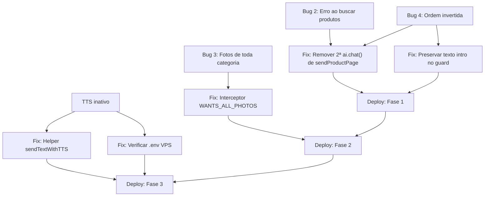

# 🔬 ESTUDO PROFUNDO — Bugs Visuais + Ativação TTS

**Data:** 2026-04-09
**Contexto:** Bugs identificados via screenshots do WhatsApp durante teste ao vivo
**Escopo:** 3 bugs de comportamento + 1 feature (TTS ElevenLabs)

---

## ÍNDICE

1. [BUG 2 — "Erro ao buscar produtos" no meio do catálogo](#bug-2)
2. [BUG 3 — "Quero ver todas as fotos" mostra só o último produto](#bug-3)
3. [BUG 4 — Resposta da IA chega DEPOIS dos produtos (ordem invertida)](#bug-4)
4. [TTS — ElevenLabs não está sendo usado apesar de TTS_ENABLED=true](#tts)
5. [Plano de Implementação](#plano)

---

<a id="bug-2"></a>
## 🔴 BUG 2 — "⚠️ Erro ao buscar produtos." no meio do catálogo

### O que o usuário vê

Após o catálogo de uma categoria ser exibido com sucesso (imagens e vitrines apareceram), a mensagem "⚠️ Erro ao buscar produtos." aparece no final. Os produtos já tinham sido mostrados — o erro parece sem sentido.

### Rastreamento no código

**Fluxo completo quando o cliente pede uma categoria (ex: infantil feminino):**

```
Cliente: "quero ver infantil feminino"
  → IA retorna [VER:femininoinfantil]
  → executeAction() chama showCategory() (index.js:1284)
    → showCategory() chama sendProductPage() (index.js:2420)
      → sendProductPage() envia lista de texto ✅ (linha 2582)
      → sendProductPage() envia vitrines com imagens ✅ (linhas 2584-2595)
      → sendProductPage() chama ai.chat() para gerar follow-up (LINHA 2610) ← AQUI
```

**A linha 2610 é o ponto de falha:**

```js
// index.js, sendProductPage(), linhas 2610-2621
const aiRaw = await ai.chat(session.history, buildAiContext(session));  // ← SE FALHAR...
const { cleanText } = ai.parseAction(aiRaw);
if (cleanText) {
  // ...envia follow-up
}
```

**O problema:** `sendProductPage()` NÃO tem try-catch ao redor da chamada `ai.chat()`. Se o Gemini retornar erro (rate limit 429, timeout, resposta malformada), a exceção **sobe** para o `catch` de `showCategory()`:

```js
// index.js, showCategory(), linhas 2421-2424
} catch (err) {
  logger.error({ slug, code: err.code, status: err.response?.status, err: err.message }, '[showCategory] Error');
  await zapi.sendText(phone, '⚠️ Erro ao buscar produtos.');  // ← MENSAGEM ENGANOSA
}
```

### Causa raiz

A chamada `ai.chat()` dentro de `sendProductPage()` (linha 2610) NÃO tem tratamento de erro próprio. Quando o Gemini falha (rate limit, timeout, etc.), o erro propaga para o catch de `showCategory()` que envia "Erro ao buscar produtos" — uma mensagem que sugere falha no WooCommerce, quando na verdade foi a IA que falhou.

Os produtos já foram enviados com sucesso. Apenas o texto de follow-up da IA falhou.

### Impacto

- **Experiência:** O cliente vê uma mensagem de erro assustadora, mesmo tendo recebido todos os produtos normalmente.
- **Funcional:** O follow-up da IA (com menu "Escolher" / "Ver Mais") não é enviado, então o cliente fica sem botões de navegação.
- **Silencioso:** O log registra `[showCategory] Error` o que dificulta debugar — parece erro de WooCommerce.

### Correção proposta

Envolver a chamada `ai.chat()` em `sendProductPage()` com try-catch específico, e enviar um menu determinístico como fallback:

```js
// sendProductPage(), APÓS o loop de vitrines (depois da linha 2601):

let cleanText = '';
try {
  const nudge = hasMore
    ? `[SISTEMA: Você mostrou a página ${session.currentPage}...]`
    : `[SISTEMA: Você mostrou todos os produtos...]`;
  appendHistory(session, 'system', nudge);
  conversationMemory.refreshConversationMemory(session, { action: { type: 'VER_CATEGORIA', payload: session.currentCategory } });

  const aiRaw = await ai.chat(session.history, buildAiContext(session));
  const parsed = ai.parseAction(aiRaw);
  cleanText = parsed.cleanText || '';
} catch (aiErr) {
  logger.error({ err: aiErr?.message || String(aiErr) }, '[sendProductPage] Falha na IA — usando follow-up determinístico');
  cleanText = '';  // Falha silenciosa — menu determinístico abaixo cobre
}

if (cleanText) {
  appendHistory(session, 'assistant', cleanText);
  conversationMemory.refreshConversationMemory(session, { assistantText: cleanText });
}

// Menu determinístico — SEMPRE enviado, com ou sem texto da IA
const menuText = cleanText || 'Me diz o número da peça que gostou, ou escolhe uma opção abaixo 😊';
if (session.items.length > 0) {
  await sendCartOptions(phone, session, menuText);
} else if (hasMore && session.activeCategory) {
  await sendCatalogBrowseOptions(phone, session, menuText);
} else {
  await sendCategoryMenu(phone, menuText);
}
```

**O mesmo padrão deve ser aplicado em `searchAndShowProducts()` (linhas 2420-2426)** — que também chama `ai.chat()` sem tratamento independente.

---

<a id="bug-3"></a>
## 🟠 BUG 3 — "Quero ver todas as fotos" mostra só o último produto

### O que o usuário vê

Após ver a vitrine de uma categoria (ex: infantil feminino com 5 produtos), o cliente diz "Quero ver todas as fotos". O bot responde "📸 Enviando as fotos de Pijama infantil feminino - Ref 731S..." — mostrando fotos de apenas **um** produto (o último da lista).

### Rastreamento no código

**Fluxo quando o cliente diz "Quero ver todas as fotos":**

```
1. extractTextFromEvent → text = "Quero ver todas as fotos"
2. IS_PHOTO_REQUEST = true (contém "fotos")                     ← linha 1048
3. EFFECTIVE_PHOTO_REQUEST = true                                ← linha 1052
4. quotedProductIdx = null (sem número no texto)                 ← linhas 1054-1062
5. photoProductRef = null (sem quote nem número)                 ← linha 1068
6. Bloco 1069-1073: PULADO (photoProductRef é null)
7. canUseLastViewedFallback = true (sem quotedMessage)           ← linha 1089
8. session.lastViewedProduct existe = TRUE                       ← linha 1090
9. → showProductPhotos(from, lastViewedProductIndex, session)    ← linha 1093
```

**Linha decisiva — 1090:**
```js
if ((EFFECTIVE_PHOTO_REQUEST || ...) && !quotedProductIdx && canUseLastViewedFallback && session.lastViewedProduct) {
  const idx = session.lastViewedProductIndex || 1;
  await showProductPhotos(from, idx, session);  // ← SÓ MOSTRA UM PRODUTO
  return;
}
```

### Causa raiz

O sistema **não tem conceito de "todas as fotos da categoria"**. A palavra "todas" é ignorada — a lógica processa "fotos" como trigger, não encontra número de produto, e cai no fallback `lastViewedProduct`, que mostra apenas o último produto visualizado.

O `showProductPhotos()` (linhas 2333-2366) mostra todas as fotos de **um único produto**, nunca de vários.

Não existe nenhum handler para "quero ver todas as fotos de todos os produtos".

### Impacto

- **Experiência:** O cliente quer ver um catálogo visual completo e recebe fotos de apenas uma peça. Parece que o bot não entendeu.
- **Venda perdida:** Se o cliente quer comparar visualmente antes de comprar, não consegue.

### Correção proposta

Adicionar detecção de "todas as fotos" como intent distinto. Quando o cliente diz "todas as fotos" sem especificar número, enviar as fotos de cada produto da categoria:

**Opção A — Novo interceptor no webhook (ANTES do bloco de foto, após linha 1048):**

```js
// Intent: "todas as fotos" / "fotos de tudo" / "ver as fotos de todos"
const WANTS_ALL_PHOTOS = /\b(todas?\s+as?\s+fotos?|fotos?\s+de\s+tud[oa]|fotos?\s+de\s+todos?|ver\s+tud[oa]|todas?\s+as?\s+imagens?)\b/i.test(text);

if (WANTS_ALL_PHOTOS && session.products?.length > 0) {
  logger.info({ from, productCount: session.products.length }, '[Intercept] Pedido de TODAS as fotos da categoria');
  await zapi.sendText(from, `📸 Enviando as fotos dos ${session.products.length} produtos! Vai levar um instante...`);

  for (const [i, product] of session.products.entries()) {
    if (product.images?.length > 0) {
      for (const [j, url] of product.images.entries()) {
        await zapi.sendImage(from, url, `${i + 1}. ${product.name} — Foto ${j + 1}/${product.images.length}`);
        await zapi.delay(400);
      }
    }
  }

  await zapi.sendText(from, 'Pronto, amor! Me diz o número da peça que gostou 😊');
  persistSession(from);
  return;
}
```

**Opção B (mais conservadora) — Limite de 5 produtos por vez:**

Se a categoria tiver muitos produtos (20+), enviar todas as fotos pode causar flood. Limitar a 5 produtos por vez e perguntar se quer continuar.

**Recomendação:** Opção B com limite de 5. Se o cliente quer mais, ele pede "continua" ou "mais fotos".

---

<a id="bug-4"></a>
## 🔴 BUG 4 — Resposta da IA chega na ordem cronológica ERRADA

### O que o usuário vê

O cliente pergunta "Tem masculino?". A sequência no WhatsApp é:

```
1. 🔍 "Buscando produtos MASCULINO..."           ← loading message
2. 📦 "MASCULINO — Produtos 1–7 de 7:..."         ← lista de texto
3. [Vitrines com imagens e botões "Comprar"]       ← product showcases
4. "Ah, sim! Temos sim, claro! Olha só..."         ← RESPOSTA DA IA (DEVERIA SER PRIMEIRO!)
5. [Menu "Escolher"]                               ← option list
```

A mensagem amigável da IA ("Ah, sim! Temos sim!") deveria vir **ANTES** dos produtos, não **depois**.

### Rastreamento no código

**O fluxo completo, passo a passo:**

```
Cliente: "Tem masculino?"
  ↓
Webhook recebe → text = "Tem masculino?"
  ↓
ai.chat() é chamado (index.js:1123)
  → Gemini retorna: "Ah, sim! Temos sim, claro! [VER:masculino]"
  ↓
parseAction() separa:
  → cleanText = "Ah, sim! Temos sim, claro!"
  → action = { type: 'VER', payload: 'masculino' }
  ↓
GUARD (linha 1202):
  if (action && ['VER', 'BUSCAR', 'PROXIMOS'].includes(action.type)) {
    cleanText = '';  // ← DESCARTA O TEXTO DA IA!
  }
  ↓
Linha 1234: cleanText é vazio → NÃO envia nada ao cliente
  ↓
Linha 1258: executeAction(from, action, session)
  → showCategory('masculino') → sendProductPage()
    → Envia lista de produtos
    → Envia vitrines (imagens + botões)
    → Chama ai.chat() DE NOVO (linha 2610) ← SEGUNDA chamada à IA
    → IA gera: "Ah, sim! Temos sim, claro! Olha só..."
    → Envia esse texto com menu "Escolher"
```

### Causa raiz — DOIS problemas encadeados

**Problema 1 — O guard na linha 1202 DESCARTA o texto da IA para ações VER/BUSCAR/PROXIMOS:**

```js
// index.js, linhas 1202-1204
if (action && ['VER', 'BUSCAR', 'PROXIMOS'].includes(action.type)) {
  if (cleanText) logger.info({ actionType: action.type }, '[Guard] Texto descartado — ação vai mostrar produtos');
  cleanText = '';  // ← A frase amigável da IA morre aqui
}
```

O guard foi criado para evitar que a IA envie listas inventadas de produtos antes do sistema mostrar o catálogo real. Faz sentido. Mas descarta QUALQUER texto, incluindo frases introdutórias legítimas como "Ah sim, temos sim!".

**Problema 2 — `sendProductPage()` faz uma SEGUNDA chamada `ai.chat()` (linha 2610):**

Depois de enviar todos os produtos, `sendProductPage()` chama a IA novamente para gerar um follow-up. A IA, sem saber que já enviou os produtos, repete a introdução amigável — que agora aparece DEPOIS dos produtos.

### O resultado: DUPLICAÇÃO + INVERSÃO

A IA gera a frase amigável **duas vezes** (uma no webhook, uma no sendProductPage), mas:
- A primeira é descartada pelo guard
- A segunda aparece após os produtos

### Impacto

- **Experiência:** O "Ah sim, temos sim!" aparece como última mensagem, quando deveria ser a primeira. O cliente vê os produtos sem contexto, e depois vê a introdução — parece desorganizado.
- **Custo:** Duas chamadas ao Gemini por requisição (uma descartada), dobrando o custo de API.

### Correção proposta

**Estratégia: preservar o texto introdutório da primeira chamada e enviá-lo ANTES dos produtos.**

```js
// index.js, substituir o guard das linhas 1198-1215 por:

// Guard: quando a ação vai mostrar produtos, envia o texto ANTES (como intro),
// mas descarta listas inventadas com preços.
if (action && ['VER', 'BUSCAR', 'PROXIMOS'].includes(action.type)) {
  // Descarta APENAS se a IA inventou uma lista de produtos com preços
  const hasNumberedItems = (cleanText.match(/^\s*\d+[\.\)]\s+\S/mg) || []).length >= 2;
  const hasPrices = /R\s*\\?\$\s*\d|reais|\d+[,\.]\d{2}/i.test(cleanText);
  if (hasNumberedItems && hasPrices) {
    logger.info('[Guard] Lista inventada descartada');
    cleanText = '';
  }
  // Se sobrou texto legítimo (ex: "Ah sim, temos sim!"), será enviado ANTES
}
```

**E em `sendProductPage()`, REMOVER a segunda chamada `ai.chat()`** (linhas 2603-2621), substituindo por um menu determinístico:

```js
// sendProductPage(), substituir linhas 2603-2621 por:

const hasMore = session.currentPage < session.totalPages;

// Follow-up determinístico — sem segunda chamada à IA
if (session.items.length > 0) {
  await sendCartOptions(phone, session, 'Me diz o número da peça que gostou ou escolhe uma opção abaixo 😊');
} else if (hasMore && session.activeCategory) {
  await sendCatalogBrowseOptions(phone, session, 'Me diz o número da peça que gostou ou veja mais opções 😊');
} else {
  await sendCategoryMenu(phone, 'Me diz o número da peça que gostou, ou escolhe outra coleção 😊');
}
```

**Benefícios:**
- Texto da IA aparece ANTES dos produtos (ordem correta)
- Elimina a segunda chamada ao Gemini (reduz custo e latência)
- Follow-up é determinístico e confiável (sem risco de "Erro ao buscar produtos")
- Resolve simultaneamente o **Bug 2** (erro de Gemini no follow-up)

---

<a id="tts"></a>
## 🔴 TTS — ElevenLabs não está sendo usado

### Status atual do .env

```env
TTS_ENABLED=true          ← ESTÁ ATIVO no .env
ELEVENLABS_API_KEY=sk_... ← Chave configurada
ELEVENLABS_VOICE_ID=ORg...← Voice ID configurada
```

A variável existe e o código lê corretamente (`process.env.TTS_ENABLED === 'true'`).

### Onde o TTS É chamado (apenas 3 lugares)

| Local | Linha | Quando dispara | O que faz |
|---|---|---|---|
| `sendLoadingMessage()` | 1433 | Loading de showCategory / showAllCategory / searchAndShowProducts | Envia áudio do loading em vez de texto |
| Webhook — primeiro contato | 1235-1244 | Apenas no primeiro contato (`isFirstContact && TTS_ENABLED`) | Envia SOMENTE áudio (sem texto) |
| Webhook — resposta normal | 1247-1254 | Respostas da IA no webhook principal | Envia texto + áudio |

### Onde o TTS NÃO é chamado (PROBLEMA)

| Função | Mensagens sem TTS | Impacto |
|---|---|---|
| `sendProductPage()` (2610-2621) | Follow-up da IA após catálogo | Texto mais importante — nenhum áudio |
| `showAllCategory()` (2524-2538) | Follow-up após vitrine completa | Sem áudio |
| `searchAndShowProducts()` (2420-2426) | Follow-up após busca | Sem áudio |
| `sendCartOptions()` | Todas as opções de carrinho | Sem áudio |
| `sendCategoryMenu()` | Menu de categorias | Sem áudio |
| `addToCart()` | Confirmação de item adicionado | Sem áudio |
| `showCart()` | Resumo do carrinho | Sem áudio |
| `handoffToConsultant()` | Resumo do pedido | Sem áudio |
| `handoffToHuman()` | Confirmação de handoff | Sem áudio |
| `clearCart()` | Confirmação de carrinho limpo | Sem áudio |
| `sendContextualFallback()` | Fallback contextual | Sem áudio |
| `showProductPhotos()` | "Enviando fotos de..." | Sem áudio |
| `cancelCurrentFlow()` | "Sem problemas!" | Sem áudio |

### Causa raiz

O TTS funciona APENAS no fluxo principal do webhook (linhas 1234-1255). Mas a maioria das respostas visíveis ao cliente são enviadas por funções auxiliares que usam `zapi.sendText()` direto — sem passar pelo wrapper de TTS.

Além disso, para ações `VER/BUSCAR/PROXIMOS`, o guard na linha 1202 esvazia `cleanText`, fazendo o bloco de TTS do webhook (linha 1234) ser pulado inteiramente. O `sendLoadingMessage()` envia um áudio de loading ("Um momento, amor!"), mas depois disso todas as mensagens subsequentes são texto puro.

### Correção proposta

**Criar um helper `sendTextWithTTS()` que centraliza o envio text+áudio:**

```js
/**
 * Envia texto ao cliente. Se TTS estiver ativo, envia também o áudio.
 * Para mensagens curtas de sistema (confirmações, erros), o áudio é opcional.
 * @param {string} phone
 * @param {string} text
 * @param {object} options
 * @param {boolean} options.tts - Se true, envia áudio junto (default: true se TTS_ENABLED)
 * @param {boolean} options.audioOnly - Se true, envia SOMENTE áudio (default: false)
 * @param {string|null} options.replyTo - messageId para reply (optional)
 */
async function sendTextWithTTS(phone, text, options = {}) {
  const { tts: useTTS = TTS_ENABLED, audioOnly = false, replyTo = null } = options;

  if (!text) return;

  // Mensagens muito curtas (< 20 chars) ou de sistema (emojis, ⚠️, ✅) não precisam de áudio
  const isSystemMessage = /^[⚠️✅❌🔍📸🗑️🛒📦]/.test(text.trim());
  const isTooShort = text.trim().length < 20;
  const shouldTTS = useTTS && !isSystemMessage && !isTooShort;

  if (audioOnly && shouldTTS) {
    try {
      const { buffer, mimeType } = await tts.textToSpeech(text);
      await zapi.sendAudio(phone, buffer, mimeType);
      return;
    } catch (err) {
      logger.error({ err: err?.message || String(err) }, '[TTS] audioOnly fallback to text');
    }
  }

  // Envia texto
  if (replyTo) {
    await zapi.replyText(phone, text, replyTo);
  } else {
    await zapi.sendText(phone, text);
  }

  // Envia áudio em paralelo (fire-and-forget para não bloquear)
  if (shouldTTS) {
    tts.textToSpeech(text)
      .then(({ buffer, mimeType }) => zapi.sendAudio(phone, buffer, mimeType))
      .catch(err => logger.error({ err: err?.message || String(err) }, '[TTS] Error'));
  }
}
```

**Depois, substituir as chamadas críticas por `sendTextWithTTS()`:**

Prioridade alta (mensagens conversacionais que devem ter voz):

```
- addToCart() confirmação → sendTextWithTTS
- showProductPhotos() "Enviando fotos..." → sendTextWithTTS
- handoffToConsultant() resumo ao cliente → sendTextWithTTS
- handoffToHuman() confirmação → sendTextWithTTS
- cancelCurrentFlow() "Sem problemas!" → sendTextWithTTS
- sendContextualFallback() mensagens → sendTextWithTTS
```

Manter como `zapi.sendText()` (sem áudio):
```
- Mensagens de erro (⚠️)
- Mensagens para ADMIN_PHONE
- Loading messages (já têm TTS via sendLoadingMessage)
```

---

<a id="plano"></a>
## PLANO DE IMPLEMENTAÇÃO

### Fase 1 — Bug 4 + Bug 2 (são o mesmo fix)

**Estes dois bugs compartilham a mesma causa raiz** — a segunda chamada `ai.chat()` em `sendProductPage()`.

| Passo | O que fazer | Arquivo | Linhas |
|---|---|---|---|
| 1.1 | Ajustar o guard para preservar texto intro (não descartar tudo) | `index.js` | 1198-1215 |
| 1.2 | Remover a segunda `ai.chat()` de `sendProductPage()` | `index.js` | 2603-2621 |
| 1.3 | Substituir por menu determinístico com texto fallback | `index.js` | 2603+ |
| 1.4 | Fazer o mesmo em `searchAndShowProducts()` | `index.js` | 2416-2426 |

**Esforço:** ~45 min
**Impacto:** Resolve Bug 2 + Bug 4 + Reduz custos de API pela metade nas buscas de categoria

### Fase 2 — Bug 3 (fotos de toda a categoria)

| Passo | O que fazer | Arquivo | Linhas |
|---|---|---|---|
| 2.1 | Adicionar regex `WANTS_ALL_PHOTOS` antes do bloco de fotos | `index.js` | antes de 1048 |
| 2.2 | Implementar loop de envio com limite de 5 produtos | `index.js` | novo bloco |
| 2.3 | Atualizar prompt do Gemini para explicar ao cliente que pode pedir "fotos de todos" | `services/gemini.js` | SYSTEM_PROMPT |

**Esforço:** ~30 min

### Fase 3 — TTS ElevenLabs

| Passo | O que fazer | Arquivo | Linhas |
|---|---|---|---|
| 3.1 | Criar helper `sendTextWithTTS()` | `index.js` | novo helper |
| 3.2 | Substituir `zapi.sendText()` por `sendTextWithTTS()` nas funções conversacionais | `index.js` | múltiplas |
| 3.3 | Manter `zapi.sendText()` para mensagens de sistema e admin | `index.js` | — |
| 3.4 | Verificar se o `.env` da VPS tem `TTS_ENABLED=true` | VPS | `.env` |
| 3.5 | Testar ElevenLabs com curl para validar API key | VPS | terminal |

**Esforço:** ~1h

### Verificação na VPS

Antes de tudo, verificar se o TTS está realmente falhando silenciosamente na VPS:

```bash
# Na VPS, verificar os logs do bot:
grep -i "TTS\|elevenlabs\|audio" server.log | tail -20

# Testar a API key do ElevenLabs direto:
curl -s "https://api.elevenlabs.io/v1/voices" \
  -H "xi-api-key: SUA_CHAVE" | head -100
```

Se os logs mostrarem `[TTS] Error` ou `[TTS] Fallback to text`, a API key pode estar inválida ou a cota expirou.

---

## DIAGRAMA DE DEPENDÊNCIAS



---

## RESUMO EXECUTIVO

| Bug | Causa raiz | Complexidade | Prioridade |
|---|---|---|---|
| Bug 2 (Erro ao buscar) | `ai.chat()` sem try-catch em `sendProductPage()` | Fácil | 🔴 Alta |
| Bug 3 (Fotos de todos) | Não existe conceito de "fotos da categoria inteira" | Média | 🟠 Média |
| Bug 4 (Ordem invertida) | Guard descarta texto + segunda `ai.chat()` gera follow-up tardio | Média | 🔴 Alta |
| TTS inativo | `sendTextWithTTS()` não existe — TTS só roda no webhook principal | Média | 🟠 Média |

**Bugs 2 e 4 são resolvidos pelo MESMO fix** (remover segunda `ai.chat()` + preservar texto intro).
