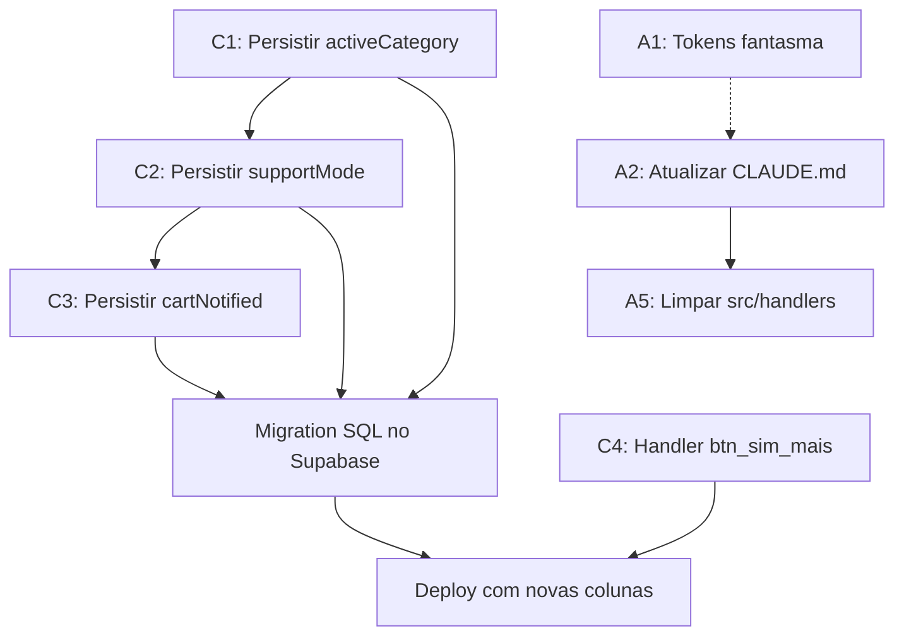

# 🔍 RELATÓRIO DE AUDITORIA COMPLETA — Agente Belux

**Data:** 2026-04-09
**Auditor:** Claude (Cowork)
**Escopo:** Varredura completa de `index.js` (2815 linhas), 10 services, `.env.example`, `CLAUDE.md`, skill e docs
**Objetivo:** Identificar bugs, inconsistências, funções quebradas e divergências entre código, documentação e lógica de negócio após refatorações recentes.

---

## SUMÁRIO DE CRITICIDADE

| Severidade | Qtd | Descrição |
|:---:|:---:|---|
| 🔴 CRÍTICO | 4 | Bugs que quebram funcionalidade em produção |
| 🟠 ALTO | 5 | Problemas que causam comportamento errado ou perda de estado |
| 🟡 MÉDIO | 4 | Inconsistências de documentação e tokens fantasma |
| 🟢 BAIXO | 3 | Melhorias de robustez e manutenção |

---

## 🔴 PROBLEMAS CRÍTICOS

### C1. `activeCategory` NÃO é persistida no Supabase

**Arquivo:** `services/supabase.js` (linhas 19-48) + `index.js` (linhas 251-293)

**O que acontece:** O campo `activeCategory` é usado extensivamente no `index.js` para controlar navegação de catálogo, exibição de produtos e menus ("VER_MAIS_PRODUTOS", "VER_OUTRA_CATEGORIA", etc.), mas na função `upsertSession()` do Supabase, apenas `current_category` é salvo — `activeCategory` é ignorado.

**Impacto em produção:**
- Quando o servidor reinicia ou a sessão é carregada do banco, `activeCategory` é reconstruída como `normalizeCategorySlug(stored.current_category)` (linha 259).
- Se `currentCategory` e `activeCategory` divergirem (ex: após `showAllCategory`), o estado fica inconsistente após reload.
- Botões como "Ver Mais Produtos" e "Ver Outra Categoria" podem não funcionar corretamente após restart.

**Como corrigir:**
```js
// supabase.js — upsertSession(), adicionar:
active_category: session.activeCategory || null,
```
E no `getSession()` do index.js, reconstruir:
```js
activeCategory: normalizeCategorySlug(stored.active_category || stored.current_category) || null,
```
Requer: adicionar coluna `active_category TEXT` na tabela `sessions` do Supabase.

---

### C2. `supportMode` NÃO é persistido no Supabase

**Arquivo:** `services/supabase.js` + `index.js` (linhas 206-210, 519-524, 2149, 2670-2688)

**O que acontece:** O campo `supportMode` ("human_pending") é usado para:
- Impedir que o bot continue tentando vender depois de um handoff humano (linha 2149-2151).
- Detectar quando o cliente retoma a compra (linha 519-524).

Mas `supportMode` **não é salvo no banco** e **não é reconstruído no `getSession()`**.

**Impacto em produção:**
- Se o servidor reinicia durante um handoff humano, o bot volta a responder como vendedora — perdendo o contexto de que uma consultora humana já foi chamada.
- Cliente e consultora recebem respostas simultâneas do bot, causando confusão.

**Como corrigir:**
```js
// supabase.js — upsertSession(), adicionar dentro do purchase_flow ou como campo separado:
support_mode: session.supportMode || null,
```
E no getSession():
```js
supportMode: stored?.support_mode || null,
```

---

### C3. `cartNotified` NÃO é persistido no Supabase

**Arquivo:** `index.js` (linhas 316-339) + `services/supabase.js`

**O que acontece:** O mecanismo de recuperação de carrinho abandonnado (a cada 30min) usa `session.cartNotified` para evitar spam. Mas esse campo **não é salvo no banco**.

**Impacto em produção:**
- Após restart do servidor, `cartNotified` volta a `undefined` para todas as sessões.
- Clientes que já receberam a mensagem de carrinho abandonado recebem **de novo** ao próximo check.
- Em cenário de deploys frequentes, clientes com carrinhos ativos recebem mensagem de recuperação repetidamente.

**Como corrigir:** Adicionar ao `upsertSession()`:
```js
cart_notified: session.cartNotified || false,
```

---

### C4. Botão "SIM" (`btn_sim_mais`) sem handler determinístico

**Arquivo:** `index.js` (linhas 356, 370)

**O que acontece:** O `extractTextFromEvent()` mapeia `btn_sim_mais` → `'SIM'`, mas **não existe nenhum interceptor determinístico** para `text === 'SIM'` no webhook. O texto "SIM" cai direto no fluxo da IA.

**Problema:** Esse botão é emitido pelo sistema (historicamente para "Sim, quero ver mais"), mas sem nenhum botão no código atual que emita `btn_sim_mais`, ele pode ser um remanescente de versão anterior. Contudo, se algum lugar emitir esse botão, a IA recebe literalmente "SIM" — sem contexto algum — e pode gerar uma resposta sem sentido.

**Impacto:** Se o botão for clicado de um menu antigo (stale), gera resposta fora de contexto. Se nunca é emitido, é código morto que polui o mapeamento.

**Como corrigir:**
1. Buscar se algum endpoint/menu ainda emite `btn_sim_mais`. Se não → remover de `extractTextFromEvent()`.
2. Se for necessário, adicionar interceptor determinístico:
```js
if (text === 'SIM') {
  // Continuar navegação na categoria ativa
  if (session.activeCategory && session.currentPage < session.totalPages) {
    await showNextPage(from, session);
  } else {
    await sendCategoryMenu(from, 'O que você quer ver agora? 😊');
  }
  persistSession(from);
  return;
}
```

---

## 🟠 PROBLEMAS ALTOS

### A1. Tokens fantasma no `sanitizeVisible()` que não existem no prompt/parseAction

**Arquivo:** `services/gemini.js` (linhas 89-111, 182-219)

**O que acontece:** O `sanitizeVisible()` limpa tokens que **não existem** no system prompt nem no `parseAction()`:

| Token | No prompt? | No parseAction? | No sanitize? |
|---|:---:|:---:|:---:|
| `[NOME:...]` | ❌ | ❌ | ✅ (linha 105) |
| `[FINALIZAR]` | ❌ | ❌ | ✅ (linha 102) |

**Impacto:** Se a IA gerar `[NOME:João]`, o token é limpo mas **nunca processado** — o nome do cliente é simplesmente descartado. Se o prompt instruísse a IA a capturar o nome do lojista, não existiria handler para isso.

**Como corrigir:**
- Decidir se `[NOME:...]` é funcionalidade desejada. Se sim → adicionar ao prompt, parseAction e executeAction.
- Se não → remover do sanitize para evitar manutenção de código morto.
- Idem para `[FINALIZAR]`.

---

### A2. CLAUDE.md desatualizado — lista arquivos que não existem

**Arquivo:** `.claude/CLAUDE.md` (linhas 24-25)

**O que acontece:** O mapa do projeto lista:
```
├── openrouter.js      ← IA Bela: chat(), parseAction() — STANDBY (Llama 4 Maverick)
├── groq.js            ← IA Bela: chat(), parseAction() — STANDBY (llama-3.3-70b)
```
Mas **nenhum desses arquivos existe** em `services/`. Também faltam no mapa:
- `services/semantic.js` — análise semântica (361 linhas, fundamental)
- `services/stt.js` — speech-to-text (91 linhas)
- `services/learnings.js` — sistema de aprendizados

E o CLAUDE.md lista referências a docs do Obsidian como `13 - Serviço OpenRouter.md` e o modelo "Groq" que não são mais relevantes.

**Impacto:** Qualquer dev ou agente que consulte o CLAUDE.md vai ter uma visão errada da stack e pode tentar importar módulos inexistentes.

**Como corrigir:** Atualizar o mapa do projeto em CLAUDE.md para refletir a realidade:
```
services/
├── gemini.js               ← IA Bela: chat(), parseAction() — ATIVO (Gemini 2.5 Flash)
├── semantic.js             ← Análise semântica de mensagens
├── stt.js                  ← Speech-to-Text via Gemini
├── tts.js                  ← Text-to-Speech via ElevenLabs
├── zapi.js                 ← Envio de mensagens (Z-API)
├── woocommerce.js          ← Catálogo de produtos
├── supabase.js             ← Persistência: sessões, learnings, pedidos
├── learnings.js            ← Sistema de aprendizados dinâmicos
├── conversation-memory.js  ← Memória de conversa estruturada
└── logger.js               ← Logger estruturado (pino)
```

---

### A3. `.env.example` incompleto — variáveis usadas no código ausentes

**Arquivo:** `.env.example`

**Variáveis usadas no código mas NÃO documentadas em `.env.example`:**

| Variável | Onde é usada | Default |
|---|---|---|
| `ADMIN_PHONE` | `index.js` linha 21 | `null` |
| `MAX_HISTORY_MESSAGES` | `index.js` linha 23 | `40` |

**Impacto:** Deploy sem essas variáveis funciona (têm defaults), mas `ADMIN_PHONE` sem valor faz com que **handoff humano e notificações de pedido sejam silenciosamente ignorados** — o bot confirma ao cliente que "avisou a consultora", mas nada acontece.

**Como corrigir:** Adicionar ao `.env.example`:
```env
# Notificação de pedidos — número da consultora (com DDI, sem + ou espaços)
ADMIN_PHONE=5585999999999

# Máximo de mensagens no histórico da sessão (default: 40)
# MAX_HISTORY_MESSAGES=40
```

---

### A4. Bloco `__LEGACY_TAMANHO_UNUSED__` com código morto dentro do switch

**Arquivo:** `index.js` (linhas 1360-1400)

**O que acontece:** Um case inteiro está comentado com `/* ... */`, mas dentro dele há código com erros de sintaxe (variáveis indefinidas como `size`, `idx`, referência a `session.items.push` com formato antigo). Se alguém descomentar por engano, o servidor quebra.

**Impacto:** Código morto de 40 linhas no meio do switch case principal, com variáveis incorretas. Risco de reativação acidental.

**Como corrigir:** Remover inteiramente o bloco comentado. A funcionalidade já foi reimplementada no case `TAMANHO` (linhas 1310-1343) e `QUANTIDADE` (linhas 1346-1358).

---

### A5. `src/handlers/` vazio — diretório fantasma

**Arquivo:** `src/handlers/` (diretório)

**O que acontece:** O diretório existe mas está completamente vazio. A skill do projeto referencia `src/handlers/` como "Handlers de ações do webhook", mas toda a lógica de handling está no monolito `index.js`.

**Impacto:** Confusão de arquitetura. A skill e documentação prometem modularização que não existe.

**Como corrigir:** Ou remover o diretório `src/handlers/` e atualizar a skill, ou (melhor) começar a extrair handlers do `index.js` para módulos separados.

---

## 🟡 PROBLEMAS MÉDIOS

### M1. Regex `PURE_GREETING` pode colidir com respostas legítimas

**Arquivo:** `index.js` (linha 777)

```js
const PURE_GREETING = /^(oi+|ol[aá]+|bom dia|...|vcs estao ai)(\s|[!?.,]|$)/i;
```

**Problema:** "vcs estao ai" é tratado como saudação pura e causa **reset completo** da sessão (linhas 786-797: zera history, products, currentCategory, etc.). Mas um cliente pode dizer "vcs estao ai" no meio de uma conversa ativa sem querer recomeçar do zero.

**Mitigação existente:** O reset só dispara se `staleConversation` (inatividade > 30min). Mas o guard `fsmIsIdle` pode ser verdadeiro mesmo com carrinho ativo.

**Impacto:** Carrinho é preservado (ok), mas histórico, produtos carregados e categoria ativa são zerados — o cliente perde o contexto do catálogo.

**Como corrigir:** Adicionar guard: não resetar se `session.items.length > 0` (carrinho ativo indica conversa real).

---

### M2. Skill description referencia Groq (desatualizada)

**Arquivo:** `agente-belux.skill` e `.claude/skills/agente-belux/`

A skill file menciona "Groq SDK", "modelo qwen3-32b" e "Groq" nas keywords de trigger. Isso é completamente desatualizado — o projeto usa Gemini 2.5 Flash.

**Como corrigir:** Atualizar description da skill para mencionar Gemini em vez de Groq.

---

### M3. `inferActionFromSemantics` pode gerar ação `FALAR_ATENDENTE` que não está no `parseAction()`

**Arquivo:** `services/semantic.js` (linha 293) + `services/gemini.js` (linhas 196-209)

O `inferActionFromSemantics()` retorna `{ type: 'FALAR_ATENDENTE' }`, que é tratado no `executeAction()` (linha 1458), mas o `parseAction()` do Gemini não conhece esse tipo — só conhece `HANDOFF`. Isso funciona porque o semantic fallback é aplicado **depois** do parseAction, mas cria uma assimetria confusa no código.

**Como corrigir:** Documentar explicitamente que `FALAR_ATENDENTE` e `CANCELAR_FLUXO` são actions geradas apenas pelo semantic engine e nunca pela IA.

---

### M4. `deleteExpiredSessions` compara `last_activity` com timestamp, mas o tipo pode ser incompatível

**Arquivo:** `services/supabase.js` (linhas 50-60)

```js
const cutoff = Date.now() - timeoutMs;
.lt('last_activity', cutoff);
```

Se `last_activity` no banco é um número (epoch em ms), funciona. Mas se for `timestamptz` (padrão Supabase), a comparação de `<` com um número inteiro pode falhar silenciosamente.

**Como corrigir:** Verificar o tipo da coluna no Supabase. Se for `timestamptz`, converter:
```js
const cutoff = new Date(Date.now() - timeoutMs).toISOString();
```

---

## 🟢 PROBLEMAS BAIXOS

### B1. `index.js` é um monolito de 2815 linhas

O arquivo único contém: webhook handler, FSM, grade parser, todos os flows de produto, cart, handoff, quote resolution (5 estratégias), 50+ funções. Isso torna debug e manutenção extremamente difíceis.

**Sugestão:** Extrair em módulos:
- `handlers/fsm.js` — FSM de compra
- `handlers/cart.js` — operações de carrinho
- `handlers/catalog.js` — showCategory, showAllCategory, showNextPage
- `handlers/handoff.js` — handoff humano e de consultora
- `handlers/grade-parser.js` — parseGradeText e lógica de grade
- `lib/session.js` — getSession, persistSession, create

### B2. Inconsistência de nomes: `handoffToHuman` vs `handoffToConsultant`

Existem duas funções de handoff distintas mas com nomes confusos:
- `handoffToHuman()` — sinaliza atendente humano (sem pedido formal)
- `handoffToConsultant()` — fecha pedido e envia resumo completo com fotos

Os nomes não são autoexplicativos. Sugestão: renomear para `requestHumanSupport()` e `submitOrder()`.

### B3. Race condition teórica entre cleanup e webhook

O `setInterval` de limpeza de sessões (linhas 303-313) roda a cada 10 min e deleta sessões expiradas. Se um webhook chegar exatamente no momento da limpeza, é possível (embora improvável) que a sessão seja deletada durante o processamento.

**Mitigação sugerida:** Usar lock ou verificar `lastActivity` dentro do webhook antes de deletar.

---

## PLANO DE IMPLEMENTAÇÃO

### Fase 1 — Correções Críticas (URGENTE — impacto em produção)

| # | Tarefa | Arquivo(s) | Esforço |
|---|---|---|---|
| 1.1 | Adicionar `active_category`, `support_mode`, `cart_notified` ao upsertSession e getSession | `services/supabase.js`, `index.js` | ~30 min |
| 1.2 | Criar migration no Supabase para as novas colunas | Supabase Dashboard/SQL | ~15 min |
| 1.3 | Resolver handler do botão `btn_sim_mais` (remover ou implementar) | `index.js` | ~15 min |

### Fase 2 — Problemas Altos (próxima sessão de dev)

| # | Tarefa | Arquivo(s) | Esforço |
|---|---|---|---|
| 2.1 | Limpar tokens fantasma (`[NOME]`, `[FINALIZAR]`) ou implementá-los | `services/gemini.js` | ~20 min |
| 2.2 | Atualizar CLAUDE.md: mapa do projeto, stack, docs referenciados | `.claude/CLAUDE.md` | ~30 min |
| 2.3 | Completar `.env.example` com `ADMIN_PHONE` e `MAX_HISTORY_MESSAGES` | `.env.example` | ~5 min |
| 2.4 | Remover bloco `__LEGACY_TAMANHO_UNUSED__` comentado | `index.js` | ~5 min |
| 2.5 | Remover ou documentar `src/handlers/` vazio | `src/handlers/` | ~5 min |

### Fase 3 — Problemas Médios (manutenção contínua)

| # | Tarefa | Arquivo(s) | Esforço |
|---|---|---|---|
| 3.1 | Adicionar guard de carrinho ativo no reset de saudação | `index.js` (linha 783) | ~10 min |
| 3.2 | Atualizar skill description (Groq → Gemini) | `agente-belux.skill` | ~10 min |
| 3.3 | Verificar tipo da coluna `last_activity` no Supabase | Supabase Dashboard | ~10 min |
| 3.4 | Documentar actions exclusivas do semantic engine | `services/semantic.js` | ~10 min |

### Fase 4 — Refatoração Estrutural (quando houver janela)

| # | Tarefa | Arquivo(s) | Esforço |
|---|---|---|---|
| 4.1 | Modularizar `index.js` em handlers separados | `index.js` → `handlers/*.js` | ~4h |
| 4.2 | Renomear `handoffToHuman`/`handoffToConsultant` para nomes claros | Vários | ~30 min |

---

## DEPENDÊNCIAS ENTRE TAREFAS



---

## OBSERVAÇÕES FINAIS

O código é funcional e bem estruturado para um monolito — as funções são coerentes, a FSM de compra é robusta, e os mecanismos de fallback (5 estratégias de quote resolution, semantic fallback, stale event detection) demonstram maturidade. Os problemas encontrados são todos contornáveis e nenhum é um bug que crasha o servidor — são **perdas de estado silenciosas** que degradam a experiência em cenários de restart/reconexão.

A prioridade absoluta é a **Fase 1** (persistência no Supabase), pois afeta diretamente clientes em produção que voltam após um restart do servidor.
